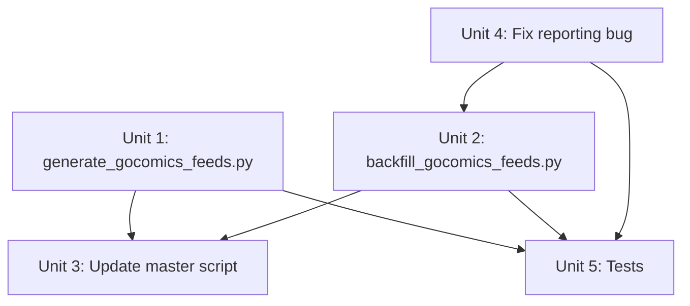

# Fix: Use Phase 1 Data for GoComics Feed Generation

## Overview

GoComics feed generation (Phase 2) re-fetches every comic individually for the last 10 days (~4,670 requests) instead of using Phase 1's already-collected data. This redundant fetching started failing intermittently, causing zero feeds to update on 2026-03-31 while reporting "ALL SUCCESS." This plan eliminates the redundant requests by adopting the same data-driven pattern already used by Comics Kingdom and TinyView generators, adds a separate backfill script for manual recovery, and fixes the misleading success reporting.

## Problem Frame

The daily pipeline has two phases for GoComics: Phase 1 collects all comics and saves results to `data/comics_YYYY-MM-DD.json`. Phase 2 (`update_feeds.py`) ignores this data entirely and re-fetches every comic individually with high concurrency. This high-volume approach has become unreliable.

Additionally, `process_comic()` ignores `update_feed()`'s return value, unconditionally logging success. The master script only checks exit codes, so the entire run reports "ALL SUCCESS" with 0 feeds actually updated.

## Requirements Trace

- R1. Daily GoComics feed generation must work without making per-comic requests to GoComics
- R2. All comics in Phase 1 data must have today's entry merged into their existing feed XML
- R3. Comics not in Phase 1 data (didn't publish today) must have their existing feeds preserved unchanged
- R4. A separate manual backfill script must exist for recovery scenarios, with rate limiting
- R5. Success reporting must accurately reflect how many feeds were updated vs skipped vs failed
- R6. Existing feed format, retention cap (100 entries), and deduplication behavior must be preserved
- R7. The new script must follow the same patterns as `generate_comicskingdom_feeds.py`

## Scope Boundaries

- Not changing Phase 1 data collection -- it works fine
- Not changing other source generators (Comics Kingdom, TinyView, Creators, Far Side, New Yorker)
- Not adding automatic backfill to the daily pipeline -- backfill is manual-only
- Not changing `ComicFeedGenerator` or the feed XML format
- Not refactoring `regenerate_feed()` -- reusing it as-is for the backfill script

## Context & Research

### Relevant Code and Patterns

- **`scripts/generate_comicskingdom_feeds.py`** -- The primary pattern to follow. Loads scraped data from `data/comicskingdom_*.json`, groups by slug, converts to feed entries, calls `ComicFeedGenerator.generate_feed()`. Has `load_scraped_data(days_back=10)` that loads multiple day files.
- **`scripts/generate_tinyview_feeds_from_data.py`** -- Same pattern, loads from `data/tinyview_*.json`.
- **`scripts/update_feeds.py`** -- Current GoComics generator. Contains `regenerate_feed()` (merge logic) needed by backfill. Contains the `process_comic()` reporting bug.
- **`comiccaster/feed_generator.py`** -- `ComicFeedGenerator.generate_feed()` -- the shared feed writer.
- **GoComics data format** (`data/comics_YYYY-MM-DD.json`): `{name, slug, image_url, date, url, category}` -- single image per entry, unlike Comics Kingdom which has `image_urls` arrays.

### Institutional Learnings

- High-concurrency requests to GoComics are unreliable. The data-driven approach avoids this entirely.
- The pipeline was deliberately designed to be resilient (`4e6650197`) -- individual failures don't kill the run. The new script should follow this convention.

## Key Technical Decisions

- **Follow the Comics Kingdom pattern rather than inventing a new one.** CK's `generate_comicskingdom_feeds.py` already solves this exact problem. The GoComics version will be structurally similar but simpler (single `image_url` field, no vintage variant logic, no live-fetch fallback needed).
- **Load multiple days of Phase 1 data, not just today.** Like CK's `load_scraped_data(days_back=10)`, the new script loads the last 10 days of `data/comics_*.json` files. This provides natural backfill for recent misses without needing the heavy backfill script, and produces feeds with the same depth as the current approach.
- **Use `ComicFeedGenerator.generate_feed()` directly, not `regenerate_feed()`.** The CK and TinyView generators both call `generate_feed()` which writes a complete feed from the provided entries. This is simpler and more reliable than the merge-based `regenerate_feed()`. The backfill script will use `regenerate_feed()` since it needs to merge partial scrapes into existing feeds.
- **Keep `update_feeds.py` intact but fix its reporting bug.** The backfill script will import key functions from it. Don't break those interfaces.
- **Backfill uses conservative concurrency and pacing.** Tuned to be a polite client.

## Open Questions

### Resolved During Planning

- **Should the new script load only today's data or multiple days?** Resolution: Multiple days (10), matching CK pattern. This handles recent gaps without the backfill script.
- **Should the new script use `generate_feed()` or `regenerate_feed()`?** Resolution: `generate_feed()`, matching CK/TinyView pattern. Simpler and doesn't depend on parsing existing XML.
- **Should `update_feeds.py` be renamed or deprecated?** Resolution: No. Keep it functional. The backfill script imports from it, and it documents the original approach.

### Deferred to Implementation

- Exact error message format for the summary report -- will follow CK's style
- Whether `category` field from Phase 1 data needs special handling in feed generation

## Implementation Units

- [x] **Unit 1: Create `scripts/generate_gocomics_feeds.py`**

  **Goal:** New daily GoComics feed generator that reads Phase 1 data instead of scraping.

  **Requirements:** R1, R2, R3, R6, R7

  **Dependencies:** None

  **Files:**
  - Create: `scripts/generate_gocomics_feeds.py`
  - Test: `tests/test_generate_gocomics_feeds.py`

  **Approach:**
  - Follow `generate_comicskingdom_feeds.py` structure closely
  - `load_scraped_data(days_back=10)` -- glob `data/comics_*.json`, load last 10, group entries by slug
  - `load_comics_list()` -- load from `comics_list.json` (GoComics source) + `political_comics_list.json`
  - `generate_feed_for_comic(comic_info, scraped_data, generator)` -- convert scraped entries to feed format, call `generator.generate_feed()`
  - Entry conversion: `image_url` → `images: [{url, alt}]` list (single item), `date` → `pub_date` datetime, `url` → `id`
  - Deduplication by URL (same as CK)
  - Summary: print counts of successful, skipped (no data), and total
  - Exit 0 always (matching pipeline resilience convention)

  **Patterns to follow:**
  - `scripts/generate_comicskingdom_feeds.py` -- overall structure, `load_scraped_data()`, `generate_feed_for_comic()`
  - `scripts/generate_tinyview_feeds_from_data.py` -- logging style

  **Test scenarios:**
  - Happy path: Load Phase 1 JSON with 3 comics, verify 3 feed XMLs created with correct entries
  - Happy path: Load multiple days of data, verify entries from all days appear in feeds sorted correctly
  - Edge case: Comic in catalog but not in Phase 1 data -- feed should not be created/modified, count as "skipped"
  - Edge case: Comic in Phase 1 data but not in catalog -- should be ignored
  - Edge case: Empty Phase 1 data file -- script exits 0, logs warning, no feeds generated
  - Edge case: No Phase 1 data files found -- script exits with error message
  - Edge case: Duplicate entries for same comic on same date across files -- deduplicated by URL
  - Happy path: Political comics loaded from separate list and processed alongside regular comics

  **Verification:**
  - Script runs successfully against real `data/comics_2026-03-31.json`
  - Generated feed XML for a known comic matches expected format
  - All tests pass

- [x] **Unit 2: Create `scripts/backfill_gocomics_feeds.py`**

  **Goal:** Manual backfill script with rate limiting for recovery scenarios.

  **Requirements:** R4, R6

  **Dependencies:** Unit 4 (fix reporting so imports work correctly)

  **Files:**
  - Create: `scripts/backfill_gocomics_feeds.py`
  - Test: `tests/test_backfill_gocomics_feeds.py`

  **Approach:**
  - CLI args via `argparse`: `--comic <slug>` or `--all`, `--days <N>` (default 10)
  - Import fetching and feed merge functions from `update_feeds`
  - Conservative concurrency and pacing between requests
  - For each comic+date: fetch data, collect results, then merge into existing feed
  - Track and report real success/failure/skip counts
  - Never called by `local_master_update.sh`

  **Patterns to follow:**
  - Pacing pattern consistent with other source generators
  - CLI args pattern from other scripts in `scripts/`

  **Test scenarios:**
  - Happy path: Backfill single comic for 3 days with mocked scraper -- verify `regenerate_feed()` called with correct entries
  - Happy path: `--all` flag processes all comics from catalog
  - Edge case: Scraper returns None for some dates -- those dates skipped, others still processed
  - Error path: All scrape attempts fail for a comic -- reported as failed, script continues to next comic
  - Happy path: Rate limiting -- verify delay between batches (mock `time.sleep`)
  - Happy path: CLI argument parsing for `--comic`, `--all`, `--days`

  **Verification:**
  - Script can be invoked with `--comic garfield --days 5` without errors
  - Rate limiting is visually confirmed in log output
  - All tests pass

- [x] **Unit 3: Update `scripts/local_master_update.sh`**

  **Goal:** Swap `update_feeds.py` for `generate_gocomics_feeds.py` in the daily pipeline.

  **Requirements:** R1

  **Dependencies:** Unit 1

  **Files:**
  - Modify: `scripts/local_master_update.sh`

  **Approach:**
  - Replace `python scripts/update_feeds.py` with `python scripts/generate_gocomics_feeds.py`
  - Update the surrounding log messages to match
  - No other changes to the master script

  **Test expectation:** none -- pure config/script wiring change, verified by reading the diff

  **Verification:**
  - `grep` confirms `generate_gocomics_feeds.py` is called and `update_feeds.py` is not
  - Master script still runs end-to-end (dry run without push)

- [x] **Unit 4: Fix success reporting in `scripts/update_feeds.py`**

  **Goal:** Make `process_comic()` check `update_feed()` return value and report accurately.

  **Requirements:** R5

  **Dependencies:** None

  **Files:**
  - Modify: `scripts/update_feeds.py`
  - Test: `tests/test_update_feeds.py` (add/modify tests for reporting)

  **Approach:**
  - `process_comic()`: check return value of `update_feed()`. If `False`, log "no new content" (not "successfully updated") and return `False`
  - `main()`: track three categories -- `updated` (True return), `skipped` (False return, no exception), `failed` (exception). Log all three in summary.
  - Exit code: return 1 if `failed > 0`, return 0 otherwise (skipped is normal, not a failure)

  **Patterns to follow:**
  - CK generator's summary output style

  **Test scenarios:**
  - Happy path: `process_comic()` returns True when `update_feed()` returns True
  - Happy path: `process_comic()` returns False when `update_feed()` returns False (no new content)
  - Error path: `process_comic()` returns False when `update_feed()` raises exception
  - Happy path: `main()` summary counts match actual results -- mock 3 comics with 1 success, 1 skip, 1 failure
  - Integration: Log output distinguishes "Successfully updated" from "No new content" messages

  **Verification:**
  - Existing tests still pass
  - New tests verify the three-category reporting
  - Manual review of log output format

- [x] **Unit 5: Test suite for all changes**

  **Goal:** Comprehensive test coverage for new and modified code.

  **Requirements:** All

  **Dependencies:** Units 1, 2, 4

  **Files:**
  - Create: `tests/test_generate_gocomics_feeds.py`
  - Create: `tests/test_backfill_gocomics_feeds.py`
  - Modify: `tests/test_update_feeds.py`

  **Approach:**
  - Follow existing test conventions: pytest, `unittest.mock`, test classes with descriptive names
  - Use `tmp_path` for feed output directories
  - Mock file I/O for data loading, mock `ComicFeedGenerator.generate_feed()` for output verification
  - For backfill tests, mock fetching and feed merge function imports

  **Test scenarios:** Covered in Units 1, 2, and 4 above.

  **Verification:**
  - `pytest -v` passes with all new and existing tests
  - No regressions in existing test suite

## System-Wide Impact

- **Interaction graph:** `local_master_update.sh` → `generate_gocomics_feeds.py` (replaces `update_feeds.py` in daily path). `backfill_gocomics_feeds.py` → `update_feeds.py` (imports scraping and merge functions). All paths → `ComicFeedGenerator.generate_feed()`.
- **Error propagation:** New script exits 0 always (matching pipeline convention). Backfill script exits non-zero on total failure. Master script behavior unchanged.
- **State lifecycle risks:** None -- feed XML files are written atomically by `ComicFeedGenerator`. No concurrent writers since only one generator runs per source.
- **Unchanged invariants:** Feed XML format, `ComicFeedGenerator` interface, Phase 1 scraping, all other source generators, Netlify deployment trigger, 100-entry retention cap.

## Risks & Dependencies

| Risk | Mitigation |
|------|------------|
| Phase 1 data format changes break the new script | Phase 1 hasn't changed in months; add validation on load |
| `update_feeds.py` internal API changes break backfill imports | Backfill imports specific functions, not the whole module; pin to known interface |
| 10-day data loading misses comics from older gaps | Acceptable -- gaps older than 10 days require manual backfill, which is the intended workflow |
| GoComics adds new comics not yet in catalog | Same behavior as today -- they won't appear until added to `comics_list.json` |

## Sources & References

- Related code: `scripts/generate_comicskingdom_feeds.py` (primary pattern)
- Related code: `scripts/generate_tinyview_feeds_from_data.py` (secondary pattern)
- Related code: `scripts/update_feeds.py` (current GoComics generator, backfill source)

- Related commit: `4e6650197` (pipeline resilience design)
