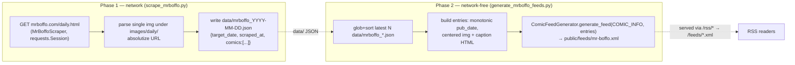

# feat: Add Mr. Boffo comic source

## Summary

Add **Mr. Boffo** (Joe Martin) as a new self-scraped, self-hosted-feed comic source,
fulfilling [GitHub issue #153](https://github.com/adamprime/comiccaster/issues/153). The
strip has no usable native RSS feed and is not carried by any source we already scrape, so
we add a dedicated scraper + generator pair following the existing two-phase architecture
(OCP via `scraper_factory.py`, never an `if/elif` chain). The daily dating model mirrors the
**New Yorker / Far Side "daily dose"** sources: no per-day permalink or archive, so entries
are dated by fetch date.

The New Yorker source is the closest template (single comic, scraped from its own site, feed
hosted by us at `/feeds/{slug}.xml`). Far Side supplies the daily-window + monotonic-pub-date
pattern for the generator.

---

## Problem Frame

Mr. Boffo's daily strip lives at `http://www.mrboffo.com/daily.html` — a hand-built static
HTML page (1990s-era table layout, plain HTTP, no HTTPS). The page embeds **exactly one**
comic image, a single `` whose `src` is under `images/daily/` (a legacy fixed path,
e.g. `images/daily/1987/011487.jpg`, that the site **overwrites in place daily** — confirmed
`Last-Modified` = today). There is:

- **No native feed.** The only feed on the site (`/atom.xml`) is a defunct Blogger feed last
  modified 2006; it does not carry the comic.
- **No syndication on a source we scrape.** Mr. Boffo is self-syndicated via Joe Martin's
  "Neatly Chiseled Features" — not on GoComics or Comics Kingdom.
- **No per-day permalink, date metadata, or archive.** The page only ever shows "the current
  strip." We therefore date each captured strip by fetch date (Eastern), exactly as Far
  Side's daily dose does.

This is a fragile upstream surface (ancient static site, plain HTTP, one overwritten image).
The scraper must fail soft — a bad fetch on any given day should warn and skip, never abort
the daily pipeline or corrupt the existing feed.

---

## Requirements

- **R1** — Capture the current Mr. Boffo daily strip image from `mrboffo.com/daily.html` and
  persist it as `data/mrboffo_<YYYY-MM-DD>.json` (Phase 1, network).
- **R2** — Generate `public/feeds/mr-boffo.xml` from the latest captured JSON, network-free
  (Phase 2), using `ComicFeedGenerator`.
- **R3** — Register the source via `scraper_factory.py` (`'mrboffo'`), not branching logic.
- **R4** — Surface the comic on the site (`comics_list.json` + `index.html` source mapping)
  and in OPML bundles (`generate-opml.js`), labeled "(Mr. Boffo)".
- **R5** — Wire both phases into the daily pipeline (`local_master_update.sh`), including the
  invariant guard and Phase 3 push-recovery regeneration.
- **R6** — Fail soft on upstream errors; never abort the pipeline or emit a broken feed.
- **R7** — Full offline test coverage (mocked HTML, no live network), matching repo
  conventions.

---

## Key Technical Decisions

- **KTD1 — Self-hosted-feed category, not external-rss.** Mr. Boffo goes in
  `public/comics_list.json` with `source: "mrboffo"` (like New Yorker / Far Side), **not** in
  `external_comics_list.json` (which is only for comics with a real native feed we point at via
  `feed_url`). We scrape and host the feed ourselves.
- **KTD2 — Slug `mr-boffo`, feed `public/feeds/mr-boffo.xml`.** Served to readers via the
  existing `/rss/*` → `/feeds/*.xml` redirect and, once the `index.html`/OPML source branches
  are added, linked directly as `/feeds/mr-boffo.xml`.
- **KTD3 — Single-image-per-day, fetch-dated.** The page shows one strip with no date signal,
  so the scraper records `target_date` (Eastern fetch date) + `scraped_at` (UTC). The
  generator synthesizes monotonic pub dates (Far Side pattern) to avoid feedgen's date-based
  dedup. We keep a small rolling window (default 3 days) of captured strips in the feed.
- **KTD4 — Robust single selector.** Parse the one `` whose `src` contains
  `images/daily/`; absolutize against `http://www.mrboffo.com/`. Exactly one such image exists
  on the page, so this is unambiguous. If zero are found, treat as a failed scrape (skip, warn).
- **KTD5 — Plain HTTP, own `requests.Session`.** The site has no HTTPS; the scraper uses its
  own `requests.Session` with a browser-like User-Agent and hand-rolled retry/backoff, exactly
  as `FarsideScraper` does (it does not use `ComicHTTPClient`, which is GoComics-oriented).
- **KTD6 — No image proxy (initially).** Far Side proxies images via a Netlify function
  because the source blocks hotlinking. We assume `mrboffo.com` does not block hotlinking and
  emit the direct image URL. If RSS readers show broken images post-deploy, a proxy function is
  a deferred follow-up (see Scope Boundaries). *Validate during implementation* by fetching the
  image URL with a generic User-Agent / no Referer.
- **KTD7 — Image lives in caller-built `description` HTML.** Following the Far Side generator,
  the entry's `description` contains the full centered `` block; we do **not** also pass
  `image_url`/`images` to the generator (which would double-render). No `<enclosure>` is emitted
  (matches repo convention, issue #28).

---

## High-Level Technical Design

Two-phase flow, mirroring the New Yorker/Far Side sources:



Registration stays OCP: a new `_SUPPORTED_SOURCES` row + import in `scraper_factory.py`.

---

## Output Structure

New files (mirroring the New Yorker / Far Side trio + tests):

```
comiccaster/
  mrboffo_scraper.py            # new: MrBoffoScraper(BaseScraper)
scripts/
  scrape_mrboffo.py             # new: Phase 1 driver → data/mrboffo_<date>.json
  generate_mrboffo_feeds.py     # new: Phase 2 driver → public/feeds/mr-boffo.xml
tests/
  test_mrboffo_scraper.py       # new: parser + output-shape (mocked fetch)
  test_mrboffo_generator.py     # new: build_entries + find_latest_snapshot
```

Modified files: `comiccaster/scraper_factory.py`, `public/comics_list.json`,
`public/index.html`, `functions/generate-opml.js`, `scripts/local_master_update.sh`,
`tests/test_scraper_factory.py`.

---

## Implementation Units

### U1. `MrBoffoScraper` — site scraper

**Goal:** A `BaseScraper` subclass that fetches `daily.html` and parses the single daily strip.

**Requirements:** R1, R6.

**Dependencies:** none.

**Files:**
- `comiccaster/mrboffo_scraper.py` (new)
- `tests/test_mrboffo_scraper.py` (new)

**Approach:**
- Subclass `BaseScraper` (`comiccaster/base_scraper.py`); `super().__init__(base_url="http://www.mrboffo.com", ...)`.
- Own `requests.Session` with browser-like `User-Agent` (mirror `FarsideScraper.__init__`),
  hand-rolled retry with `time.sleep(2 ** attempt)` backoff in `fetch_comic_page`.
- Implement the four abstract methods: `get_source_name` → `'mrboffo'`; `fetch_comic_page`
  (GET `daily.html`, `raise_for_status`, return HTML or None); `extract_images(html, ...)`
  (pure parser: `BeautifulSoup(html,'html.parser')`, find the `` whose `src` contains
  `images/daily/`, absolutize against `base_url`, return list of `{url, alt}`); `scrape_comic`
  (orchestrate fetch → parse → standardized dict).
- Add a dedicated `scrape_daily()`-style method the script calls that returns
  `{'comics': [ {image_url, original_image_url, title, caption, url} ]}` — keep the per-comic
  dict shape compatible with what the generator expects (image_url + title/caption).
- Title: a static `"Mr. Boffo"` plus the captured date (no caption text exists on the page);
  `caption` empty string.

**Patterns to follow:** `comiccaster/farside_scraper.py` (`__init__` session/headers,
`fetch_comic_page` retry loop, `_parse_daily_comic` dict shape, URL absolutization);
`comiccaster/newyorker_scraper.py` (single-comic site scraper exposing bespoke methods).

**Test scenarios** (`tests/test_mrboffo_scraper.py`, model on `tests/test_tinyview_scraper.py`):
- `extract_images` with inline HTML containing one `images/daily/...` img → returns exactly
  one image, URL absolutized to `http://www.mrboffo.com/images/daily/...`.
- `extract_images` with inline HTML containing the daily img **plus** decorative button/header
  imgs (e.g. `images/buttons/boffo.jpg`, `images/topline.gif`) → returns only the
  `images/daily/` image (selector specificity).
- `extract_images` with HTML containing **no** `images/daily/` img → returns empty list.
- `scrape_comic` / `scrape_daily` with `fetch_comic_page` patched to return mock HTML →
  result dict has `source == 'mrboffo'`, a non-empty `comics`/`images` list,
  `image_count == len(images)` (honor `BaseScraper` contract).
- `fetch_comic_page` returning `None` (simulated failure) → `scrape_*` returns a falsy/empty
  result without raising. Covers R6.
- No live network: patch `fetch_comic_page` or call `extract_images` directly; **do not** mark
  `network`.

**Verification:** new scraper tests pass; `extract_images` is a pure function provable with
inline HTML.

---

### U2. Register `mrboffo` in the scraper factory

**Goal:** Make the source selectable via `ScraperFactory.get_scraper('mrboffo')`.

**Requirements:** R3.

**Dependencies:** U1.

**Files:**
- `comiccaster/scraper_factory.py` (modify)
- `tests/test_scraper_factory.py` (modify)

**Approach:** Add `from .mrboffo_scraper import MrBoffoScraper` to the top imports
(`scraper_factory.py:13-17` area) and one row to `_SUPPORTED_SOURCES`
(`scraper_factory.py:34-42`): `'mrboffo': {'class': MrBoffoScraper, 'args': {}}`. No branching.

**Patterns to follow:** the `'newyorker': {'class': NewYorkerScraper, 'args': {}}` row.

**Test scenarios** (`tests/test_scraper_factory.py`):
- `'mrboffo'` appears in the expected-sources list assertion (`:106` area).
- `is_supported('mrboffo')` is `True`; `get_supported_sources()` includes it.
- `get_scraper('mrboffo')` returns a `MrBoffoScraper` instance (and is cached on second call).

**Verification:** factory tests pass; `get_scraper('mrboffo')` returns the right class.

---

### U3. `scrape_mrboffo.py` — Phase 1 driver

**Goal:** Capture today's strip to `data/mrboffo_<YYYY-MM-DD>.json`.

**Requirements:** R1, R6.

**Dependencies:** U1, U2.

**Files:**
- `scripts/scrape_mrboffo.py` (new)

**Approach:**
- Mirror `scripts/scrape_newyorker.py` (closest single-comic template) for structure: insert
  repo root on `sys.path`, get scraper via `ScraperFactory.get_scraper('mrboffo')`.
- Use Eastern "now" for the date stamp. Single page (no per-date URL), so a single fetch is
  enough; capturing only "today" is sufficient given the rolling-window generator. (Optionally
  no multi-day loop — the page only ever shows the current strip.)
- Write `data/mrboffo_<YYYY-MM-DD>.json` with `{target_date, scraped_at (UTC ISO), comics}`
  (Far Side snapshot shape), overwriting any existing file for the day.
- Per the pipeline invariant (U6), the JSON file **must** be written on success. Fail soft:
  on fetch/parse failure, log a warning and exit non-zero **without** writing a partial file,
  so the invariant guard reports the failure.
- Paths relative to cwd (`Path('data')`) — runs from repo root, as the pipeline does.

**Patterns to follow:** `scripts/scrape_newyorker.py` (driver shape, snapshot write),
`scripts/scrape_farside.py:46-63` (`save_daily_snapshot` payload shape, `__main__` traceback
guard, exit codes).

**Test scenarios:** Optional and lower-priority — the other scrape drivers
(`scrape_farside.py`, `scrape_newyorker.py`) have no dedicated tests; coverage lives in the
scraper (U1) and generator (U4) tests. If added (`tests/test_scrape_mrboffo.py`), patch the
script's own symbols (`@patch('scripts.scrape_mrboffo...')`) and assert it writes the dated
JSON and returns exit 0 on success / non-zero on scraper failure. `Test expectation: thin —
driver orchestration only; core logic is covered by U1.`

**Verification:** running the script from repo root writes a valid
`data/mrboffo_<date>.json`; failure path exits non-zero without a partial file.

---

### U4. `generate_mrboffo_feeds.py` — Phase 2 driver (network-free)

**Goal:** Build `public/feeds/mr-boffo.xml` from the latest captured JSON.

**Requirements:** R2, R6.

**Dependencies:** U3 (consumes its JSON shape).

**Files:**
- `scripts/generate_mrboffo_feeds.py` (new)
- `tests/test_mrboffo_generator.py` (new)

**Approach:**
- Network-free: import only `ComicFeedGenerator` + stdlib (no `requests`, no scraper). Safe to
  run after a `git reset` during push recovery.
- Hard-code `COMIC_INFO = {'name': 'Mr. Boffo', 'slug': 'mr-boffo', 'author': 'Joe Martin',
  'url': 'http://www.mrboffo.com/', 'source': 'mrboffo'}`.
- `find_latest_snapshot(data_dir)` / `find_snapshots(...)`: glob `mrboffo_*.json`, sort
  (lexicographic == date order), take the last N (default window 3), oldest-first; ignore
  non-date-shaped files (regex match, like `creators`/`farside`).
- `build_entries(snapshots)`: pure function. For each captured strip, synthesize a monotonic
  `pub_date` (Far Side pattern: `target_date.replace(hour=8, minute=i)`) to avoid feedgen
  date-dedup; build a centered `` + footer HTML `description`; entry dict =
  `{title, url, description, pub_date}`. Skip strips with no image URL but still advance the
  index.
- `main()`: `ComicFeedGenerator(output_dir='public/feeds').generate_feed(COMIC_INFO, entries)`
  → writes `public/feeds/mr-boffo.xml`. Warn-and-skip (return True) when no snapshots exist so
  a missing data file is non-fatal in recovery.

**Patterns to follow:** `scripts/generate_newyorker_feeds.py` (single-comic `COMIC_INFO` +
generate), `scripts/generate_farside_feeds.py:68-128` (`find_daily_snapshots`,
`build_daily_entries`, monotonic pub_date, description HTML, network-free guarantee).

**Test scenarios** (`tests/test_mrboffo_generator.py`, model on
`tests/test_farside_generator.py` / `tests/test_creators_generator.py`; load script via
`importlib.util.spec_from_file_location`):
- `find_latest_snapshot` against `tmp_path` with several `mrboffo_YYYY-MM-DD.json` files →
  returns the most recent; ignores a non-date-shaped file (e.g. `mrboffo_notes.json`).
- `build_entries` with a 1-strip snapshot → one entry; `description` contains
  ``; `pub_date` parses as RFC 2822 with `hour == 8`.
- `build_entries` across a multi-day window → entries count matches; titles include the date;
  pub_dates are strictly monotonic (no two equal → no feedgen dedup collision).
- `build_entries` with a snapshot whose comic lacks `image_url` → that strip is skipped, index
  still advances. Covers R6.
- (Optional) `main()` with `ComicFeedGenerator` patched (`@patch('generate_mrboffo_feeds.ComicFeedGenerator')`)
  → asserts `generate_feed` called once with `COMIC_INFO` and the built entries; returns 0.

**Verification:** generator tests pass; running from repo root produces a valid
`public/feeds/mr-boffo.xml`; no network import present.

---

### U5. Site + OPML wiring

**Goal:** Mr. Boffo appears in the web UI and OPML bundles, correctly labeled.

**Requirements:** R4.

**Dependencies:** U4 (feed must exist to be meaningfully linked; wiring itself is independent).

**Files:**
- `public/comics_list.json` (modify — add one entry)
- `public/index.html` (modify — two source branches)
- `functions/generate-opml.js` (modify — one source branch)

**Approach:**
- Add to `public/comics_list.json` (New Yorker template):
  `{"name": "Mr. Boffo", "slug": "mr-boffo", "author": "Joe Martin",
  "url": "http://www.mrboffo.com/", "source": "mrboffo", "position": <next>,
  "is_updated": true}`. (`position` = next free index.)
- `public/index.html`: add `else if (comic.source === 'mrboffo')` in both `populateComicsTable`
  (`:319-356`) and `populateComicsList` (`:403-419`), setting
  `feedPath = `/feeds/${comic.slug}.xml`` and a "(Mr. Boffo)" `sourceName`. Without this the
  feed still resolves via the `/rss/*` redirect but mislabels as "(GoComics)".
- `functions/generate-opml.js`: add `comic.source === 'mrboffo'` to the `/feeds/${slug}.xml`
  branch in `generateOPML` (`:182-186`).
- **No change** to `netlify.toml` (comics_list.json already copied) or `fetch-feed.js`.

**Patterns to follow:** the existing `newyorker` / `farside` source branches in the same
functions.

**Test scenarios:** `Test expectation: none — static catalog row + front-end source-string
branches; no Python behavior to unit-test.` (`test_external_rss_catalog.py` covers the
*external* catalog, not this one; no equivalent guard exists for `comics_list.json` source
branches.) Manual verification via the Netlify deploy preview (U7 / browser test) is the check.

**Verification:** on the deploy preview, Mr. Boffo appears in the daily list labeled
"(Mr. Boffo)" and its feed link resolves to `/feeds/mr-boffo.xml`; an OPML bundle including it
points at the hosted feed.

---

### U6. Daily pipeline wiring

**Goal:** Both phases run in the nightly update, with invariant + recovery handling.

**Requirements:** R5, R6.

**Dependencies:** U3, U4.

**Files:**
- `scripts/local_master_update.sh` (modify)

**Approach:**
- Phase 1: add a scrape block after the Creators block (`:126-132`) calling
  `python scripts/scrape_mrboffo.py`, appending to `FAILURES` on failure. Update the human
  `[N/6]` step counters to `[N/7]` across both phases (cosmetic but keep consistent).
- Phase 2: add a generate block after the Creators generate block (`:185-191`) calling
  `python scripts/generate_mrboffo_feeds.py`.
- Invariant guard (`:212-218`): add
  `check_scrape_output "Mr. Boffo" "data/mrboffo_$DATE_STR.json"`.
- Phase 3 recovery: add `"data/mrboffo_$DATE_STR.json"` to the staging-preserve list
  (`:271-285`) and `python scripts/generate_mrboffo_feeds.py || FAILURES+=("Mr. Boffo regen in
  recovery")` to the recovery regeneration block (`:302-308`). (`git add -f data/*.json
  public/feeds/*.xml` at `:247` already globs new files.)
- `mini_master_update.sh` needs no change (it just `exec`s this script). Note `local_pass2_update.sh`
  / `catchup_master_update.sh` are out of scope (see Scope Boundaries).

**Patterns to follow:** the New Yorker and Creators blocks in the same script.

**Test scenarios:** `Test expectation: none — shell orchestration; not unit-tested in this
repo (no existing shell tests).` Verified by a dry/manual run in U7.

**Verification:** a local run of `scripts/local_master_update.sh` (or the two new scripts
directly) scrapes, generates `public/feeds/mr-boffo.xml`, and the invariant guard passes.

---

### U7. End-to-end verification

**Goal:** Confirm the real strip flows end-to-end before merge.

**Requirements:** R1, R2.

**Dependencies:** U1–U6.

**Files:** none (verification only).

**Approach:**
- Run `python scripts/scrape_mrboffo.py` then `python scripts/generate_mrboffo_feeds.py` from
  repo root against the live site (one-time, manual — not a unit test). Confirm
  `data/mrboffo_<date>.json` and `public/feeds/mr-boffo.xml` are well-formed and the image URL
  loads in a browser.
- Validate KTD6: fetch the captured image URL with a plain User-Agent / no Referer to confirm
  hotlinking works in RSS readers. If it 403s, file the proxy follow-up (Scope Boundaries).
- Run full `pytest -v` (green gate before push, per CLAUDE.md).

**Test scenarios:** `Test expectation: none — manual end-to-end + full suite run.`

**Verification:** valid feed XML, loadable image, green `pytest -v`.

---

## Scope Boundaries

**In scope:** the seven units above — a working Mr. Boffo daily feed end-to-end, on the site,
in OPML, in the nightly pipeline, fully unit-tested offline.

### Deferred to Follow-Up Work
- **Image proxy** (`functions/proxy-mrboffo-image.js`) — only if U7 shows `mrboffo.com` blocks
  hotlinking from RSS readers (Far Side needs this; we assume Mr. Boffo does not).
- **Second-pass / catch-up pipelines** (`local_pass2_update.sh`, `catchup_master_update.sh`) —
  add Mr. Boffo blocks only if it should participate in those passes.
- **`public/mrboffo_comics_list.json`** standalone file — inert unless wired up; the other
  per-source list files (`farside_comics_list.json`, `newyorker_comics_list.json`) are legacy
  artifacts not read by the live site. Skip.
- **Joe Martin's other strips** (Willy 'n Ethel, Cats With Hands) — same site, same pattern;
  out of scope for issue #153, easy to add later via the same factory pattern.

**Non-goals:** scraping the defunct Blogger `atom.xml`; backfilling historical strips (no
archive exists); HTTPS for the upstream (the site is HTTP-only — not ours to fix).

---

## Risks & Dependencies

- **Fragile upstream (high likelihood, low blast radius).** Ancient static site, plain HTTP,
  one overwritten image. Mitigation: single robust selector (KTD4), fail-soft scraper (R6,
  U1/U3), invariant guard surfaces a missed day as a pipeline failure without breaking other
  sources or the existing feed.
- **Hotlinking / 403 in readers (medium).** Mitigated by U7 validation + deferred proxy.
- **`loader.py` validator trap (low).** `validate_comic_config` (`loader.py:305`) only allows
  `gocomics-*`/`tinyview`; a `source:"mrboffo"` row would fail **if** routed through
  `load_all_comics`. The self-hosted sources (newyorker, farside, comicskingdom, creators)
  already live in `comics_list.json` and are **not** routed through it (their generators
  hard-code `COMIC_INFO`), so no change is needed. If U7 surfaces a code path that does route
  it, add `'mrboffo'` to `valid_sources`.
- **`main` ships live.** Route via the existing `feat/mr-boffo-scraper` branch + PR; green
  `pytest -v` is the merge gate (CLAUDE.md).

---

## Sources & Research

- GitHub issue [#153](https://github.com/adamprime/comiccaster/issues/153) — the request.
- Live probe of `mrboffo.com/daily.html` (single `images/daily/` img; `Last-Modified` = today;
  `/atom.xml` is a 2006 Blogger feed; no `/feed/` or `/rss`).
- Internal templates: `comiccaster/farside_scraper.py`, `comiccaster/newyorker_scraper.py`,
  `scripts/scrape_newyorker.py`, `scripts/generate_farside_feeds.py`,
  `scripts/generate_newyorker_feeds.py`, `comiccaster/scraper_factory.py`,
  `comiccaster/feed_generator.py`, `scripts/local_master_update.sh`.
- Test templates: `tests/test_tinyview_scraper.py`, `tests/test_farside_generator.py`,
  `tests/test_creators_generator.py`, `tests/test_scraper_factory.py`.
- Memory: [[farside_daily_dose_is_upstream]] — the daily-selection-is-upstream model this
  source reuses.
