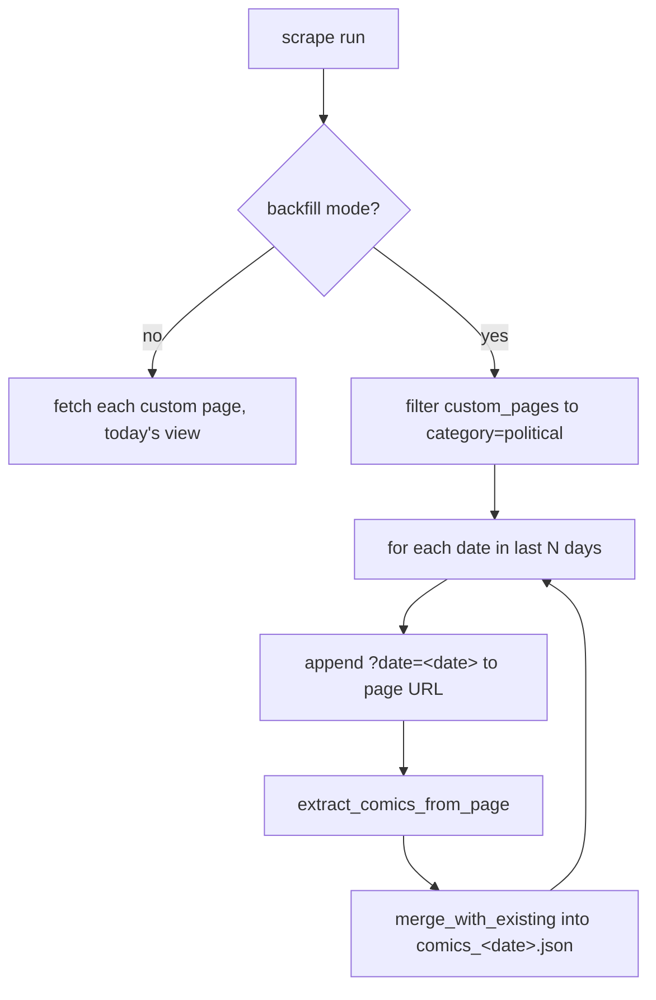

# fix: Rolling backfill for late/next-day GoComics political cartoonists (#164)

## Summary

GoComics political cartoonists who publish *after* our Pass 2 scrape window (13:00 PT
/ 16:00 ET) — or on a next-day lag — are silently and permanently dropped from their
feeds. Jack Ohman (#164) is the reported case; on 2026-07-08 he was one of **11 of 25**
political comics that published but were missed by both daily passes. Because a comic
missed on its publish date is never written to any `data/comics_<date>.json`, the feed
never recovers it.

This plan adds a **rolling backfill**: each daily run re-scrapes the political favorites
page for the last ~3 days (using the page's `?date=` parameter, which returns the correct
*settled* state for a past date) and merges any newly-appeared slugs into that day's
existing `data/comics_<date>.json`, then regenerates GoComics feeds. It reuses the proven
extraction and merge code paths and is robust to any publish time, including next-day
posters.

This extends the two-pass fix from #138 (`docs/solutions/logic-errors/gocomics-favorites-page-timing.md`),
which caught the mid-morning syndication wave but not this later tail.

---

## Problem Frame

**Confirmed root cause (not an extraction bug — a timing/coverage gap):**

- The GoComics favorites page is *reactive*: a cartoonist appears in the "updated today"
  (`ComicViewer`) set only once their strip has actually posted; otherwise they sit in
  the `FeaturesNotIssued` section. The `?date=` query selects which day's strips to show,
  but published-vs-not is evaluated as of the HTTP request time.
- Our production scrape runs Pass 1 (~03:20 PT) and Pass 2 (~13:00 PT). At those times
  only ~7–11 of the ~61 comics the favorites page lists on a given day show as "updated"
  (the roster is 71 configured political comics in `public/political_comics_list.json`; the
  page shows the subset issuing/not-issuing that day). Late/evening-Eastern and next-day
  posters are still in `FeaturesNotIssued` and are never captured.
- A slug missed on its publish date is never written to *any* dated JSON, and
  `scripts/generate_gocomics_feeds.py` only builds feeds from what the JSONs contain — so
  the miss is permanent.

**Evidence (via `scripts/diagnose_political_favorites.py`, run 2026-07-10):**

- Re-fetching the political page with `?date=2026-07-08` now shows `jackohman` in the
  `ComicViewer` (updated) set, and replaying the production extractor against that saved
  HTML pulls him out cleanly (valid strip image present). So the extractor is fine — the
  page simply didn't show him as updated at scrape time.
- Comparing that settled Jul-8 "updated" set against `data/comics_2026-07-08.json`: 11
  published political comics were missed — `bill-bramhall`, `chrisbritt`, `garymarkstein`,
  `garyvarvel`, `henrypayne`, `jackohman`, `jeffstahler`, `joe-heller`, `kal`, `mattdavies`,
  `pedroxmolina`. Jack Ohman is captured only ~once every 1–2 weeks (7 days since April),
  which is the same systemic gap, not an Ohman-specific issue.

**Who is affected:** RSS subscribers to any late/next-day-publishing political cartoonist
on GoComics; the reporter and #138's reporter are concrete examples.

---

## Scope Boundaries

**In scope:**
- Date-aware fetching of the political favorites page (append `?date=` for a past date).
- A rolling backfill over the last N days (default 3, configurable) that merges
  newly-appeared slugs into each `data/comics_<date>.json`.
- Wiring the backfill into the daily pipeline by extending Pass 2
  (`scripts/local_pass2_update.sh`), including fixing its push-conflict recovery to
  preserve *all* touched date files, not just today's.
- Regenerating GoComics feeds so recovered strips appear.
- Updating the #138 solution doc to record the late/next-day tail and this fix.

**Out of scope / non-goals:**
- The 5 daily-comics custom pages. The misses are concentrated in the political page; the
  daily pages already run ~60–68/99 updated and publish reliably overnight. Cheap to widen
  later if a daily-comic gap is ever reported (the backfill loop is page-agnostic; only the
  page-selection filter changes).
- Comics Kingdom, TinyView, Far Side, New Yorker, Creators, Mr. Boffo — none uses a single
  reactive favorites page.
- Backfilling *history* beyond the rolling window. This fixes forward; recovering April–July
  Ohman gaps is a one-off manual `diagnose`/backfill task, not this change.

### Deferred to Follow-Up Work
- Widening the backfill to all 6 custom pages if a daily-comic late-publish gap is reported.
- Auto-tuning the window length from observed backfill hit-rates (the #138 doc already
  floats self-tuning; not needed yet — YAGNI).

---

## Alternatives Considered

- **Option A — add a later same-day Pass 3 (~18:00–20:00 PT) instead of a backfill.**
  Simpler, but it only shifts the cutoff later: anyone posting after ~18:00 PT or on a
  next-day lag still slips through, and the miss is still permanent. The backfill subsumes
  A's benefit (it re-checks yesterday and the day before, well past any evening wave) *and*
  catches next-day posters. Rejected as insufficient on its own; not built.
- **Option B via `scripts/backfill_gocomics_feeds.py` (per-comic HTTP page fetches).**
  That script fetches each comic's individual page per date. It is explicitly "manual
  recovery, NOT part of the daily pipeline," is rate-limited (`MAX_WORKERS=2`), and for the
  71 configured political comics × 3 days would issue ~200 requests (vs one page fetch × 3
  days for the favorites-page route). The favorites-page route reuses the
  authenticated extraction path already trusted in production, needs one login and a handful
  of page fetches, and exercises the same `merge_with_existing` semantics. Rejected in favor
  of the favorites-page backfill.

---

## Key Technical Decisions

- **KTD1 — Reactive page + `?date=` is the recovery mechanism.** The favorites page returns
  the updated/not-issued classification for a past date as of request time. Re-fetching
  yesterday and the day before recovers anything that published late or next-day, which is
  exactly the failure mode. The diagnostic proved this for `?date=2026-07-08` (n=1). Two
  properties make the mechanism robust despite that single data point: (a) each past date is
  *re-fetched on every subsequent day it remains in the window* — a date enters as `today-1`
  and is scraped again as `today-2` and `today-3`, so a strip that is still settling on the
  first backfill pass is caught on a later one; (b) the window is the only knob, and widening
  it (R5) extends the recovery horizon. Late settling within the window is therefore self-
  healing; only lateness *exceeding* the window is missed.
- **KTD2 — Reuse `extract_comics_from_page` and `merge_with_existing` unchanged.** Extraction
  is already correct (proven by replay). `merge_with_existing` implements "new wins on slug
  overlap, preserve existing disjoint slugs": backfill is *additive* for slugs not yet in the
  target file, and *replacive* for slugs already present (the re-scraped entry overwrites the
  prior one). Overwrite is safe here — the settled `?date=` page returns the same publication-
  date strip, so a replaced entry is the same-or-fresher asset for the same date, never a
  different comic. The new code is URL date-awareness + a date loop + wiring, not new
  extraction/merge logic.
- **KTD3 — Merge into each date's own file, keyed on the scraped date.** Backfilling
  `?date=2026-07-08` writes/merges into `data/comics_2026-07-08.json`. `generate_gocomics_feeds.py`
  loads the last 90 daily files, so a recovered Jul-8 entry surfaces in the feed dated Jul 8.
  The generator sets each item's guid to the comic URL (`gocomics.com/<slug>/2026/07/08`),
  which is date-unique, so a recovered strip is a new guid, not a duplicate. For Ohman
  specifically it is also *newer* than the previously-newest Jul 2, so every reader shows it.
  **Known limitation:** a recovered strip whose date falls *before* a subscriber's newest-seen
  item is back-dated; some RSS readers suppress items older than the newest already delivered,
  so those subscribers may not surface a deep-window recovery. Acceptable — the common case
  (recovering the last day or two) is at or near the feed head.
- **KTD4 — Political page only, selected by category.** Backfill iterates
  `config['custom_pages']` filtered to `category == 'political'` (matches the diagnostic's
  own page-selection convention). Page-agnostic loop; widening later is a one-line filter
  change.
- **KTD5 — Fold into Pass 2, not a new cron entry.** Pass 2 already owns GoComics re-scrape →
  merge → regenerate → commit → push-with-recovery. The backfill is the same shape on more
  date files. This avoids a second scheduled job and a second login flow, at the cost of the
  wiring fixes in U3. **Durability precondition:** Pass 2 opens with `git reset --hard
  origin/main` (`scripts/local_pass2_update.sh:62`), so every backfilled past-date file must be
  *committed and pushed within the same run* — writing it to disk is not enough; the next day's
  reset discards anything un-pushed. This makes U3's staging fix (both the happy-path commit and
  the recovery block) load-bearing, not optional.

---

## Requirements

- **R1** — The daily pipeline captures a political cartoonist's strip even when it publishes
  after Pass 2 or on a next-day lag, within the rolling window. (Covers #164.)
- **R2** — Backfill never drops a slug already present in a target date's JSON. It adds
  missed slugs and, for a slug already present, replaces its entry with the re-scraped
  same-date strip (same publication date, same-or-fresher asset) — never a different comic.
- **R3** — Backfill reuses the existing extraction and merge code paths; no divergent parsing.
- **R4** — Recovered strips appear in the correct per-date feed entry after regeneration.
- **R5** — The window length is configurable (default 3 days) without code edits to core logic.
- **R6** — Every Pass 2 commit path — the normal happy path *and* the push-conflict recovery —
  stages every date file the run touched, not just today's.
- **R7** — Unit tests are offline; no live GoComics access in the default `pytest -v` run.

---

## High-Level Technical Design

Daily timeline and where the backfill closes the gap:

```mermaid
sequenceDiagram
    participant Cron as launchd (daily)
    participant P1 as Pass 1 ~03:20 PT
    participant P2 as Pass 2 ~13:00 PT (extended)
    participant GC as GoComics political page
    participant Data as data/comics_&lt;date&gt;.json
    participant Feed as public/feeds/*.xml

    P1->>GC: fetch today (no ?date=)
    GC-->>P1: ~7-11 of 61 updated (early wave)
    P1->>Data: write comics_TODAY.json

    P2->>GC: fetch today (--merge)
    GC-->>P2: mid-morning wave
    P2->>Data: merge into comics_TODAY.json

    Note over P2,GC: NEW backfill loop (last N days)
    loop date in [TODAY-1 .. TODAY-N]
        P2->>GC: fetch ?date=&lt;date&gt; (settled state)
        GC-->>P2: late/next-day posters now "updated"
        P2->>Data: merge_with_existing -> comics_&lt;date&gt;.json
    end

    P2->>Feed: regenerate GoComics feeds (loads 90 days)
    Note over Feed: recovered strips appear, dated correctly
```

Decision flow inside the extended scraper:



*Directional guidance for review — not implementation specification.*

---

## Implementation Units

### U1. Date-aware favorites-page URL construction

**Goal:** Let the scraper fetch a specific past date's view of a custom page by appending
`?date=<YYYY-MM-DD>` (respecting an existing `?` in the URL), mirroring how
`scripts/diagnose_political_favorites.py` already builds `target_url`.

**Requirements:** R3.
**Dependencies:** none.
**Files:**
- `scripts/authenticated_scraper_secure.py` (add a small pure helper, e.g. `page_url_for_date(base_url, date_str)`)
- `tests/test_authenticated_scraper.py` (new test class)

**Approach:** Extract the diagnostic's one-liner (`f"{base_url}{'&' if '?' in base_url else '?'}date={date}"`)
into a named helper on the production scraper so both the daily path and the new backfill
path share it. `extract_comics_from_page` already accepts a fully-formed URL, so no change to
extraction — only the URL passed in.

**Patterns to follow:** `scripts/diagnose_political_favorites.py` `target_url` construction;
existing pure-helper tests in `tests/test_authenticated_scraper.py` (`TestExtractComicSlugFromLink`).

**Test scenarios:**
- Base URL without a query string gets `?date=2026-07-08` appended.
- Base URL that already contains a `?` (query param) gets `&date=...` appended.
- Returned string is otherwise byte-identical to the base URL (no trailing slash mangling).

**Verification:** New helper unit tests pass; no behavior change to existing daily scrape.

---

### U2. Rolling backfill loop over recent dates

**Goal:** Add a backfill mode that, in one authenticated session, iterates the last N days,
fetches the political favorites page(s) with `?date=`, extracts, and merges results into each
day's `data/comics_<date>.json` via `merge_with_existing`.

**Requirements:** R1, R2, R3, R4, R5.
**Dependencies:** U1.
**Files:**
- `scripts/authenticated_scraper_secure.py` (add `--backfill-days N` CLI flag and a backfill
  routine; select political pages via `category == 'political'`; reuse `extract_comics_from_page`
  and `merge_with_existing`; add `category` metadata to each comic as the daily path does)
- `tests/test_authenticated_scraper.py` (new test class for the backfill routine)

**Approach:** A new routine computes the target dates (`today-1 .. today-N`; today itself is
already covered by the same-day Pass 2 merge, so the backfill targets *past* dates). For each
date it builds the URL (U1), scrapes with the existing extractor, stamps `category='political'`,
and merges into `output_dir / f'comics_{date}.json'` using `merge_with_existing`. Default N=3,
overridable via `--backfill-days` (and/or an env var, e.g. `GOCOMICS_BACKFILL_DAYS`, for the
pipeline — implementer's choice; keep the default in one place per R5). Structure the routine so
the per-date scrape/merge is unit-testable with the extraction function mocked (mirror how
`TestExtractComicsFromPage` uses `_mock_driver`).

**Composition with the existing `main()`:** the backfill is an *additional* loop that runs
after the existing same-day scrape/write, reusing the same authenticated driver session — not a
replacement for the same-day path. `main()` currently scrapes today's custom pages, dedupes
cross-page, and writes one `comics_TODAY.json`; the backfill loop runs when `--backfill-days > 0`
and writes each past date to *its own* `comics_<date>.json`. The routine should return (or log)
the exact list of date files it touched so U3's staging step can enumerate them.

**Execution note:** Implement test-first — write the failing backfill-loop test (mocked
extraction, `tmp_path` for date files) before the routine, then make it green. This is the
core behavioral unit.

**Patterns to follow:** `main()` in `scripts/authenticated_scraper_secure.py` for the
login → per-page extract → `category` stamping → `merge_with_existing` → write sequence;
`TestMergeWithExisting` and `TestExtractComicsFromPage` for mocking style; date iteration in
`scripts/backfill_gocomics_feeds.py` (`target_dates` via `timedelta`).

**Test scenarios:**
- **Happy path:** given a mocked extractor returning `jackohman` for `?date=2026-07-08` and an
  existing `comics_2026-07-08.json` lacking him, the merged file gains `jackohman` and keeps all
  prior slugs. (Covers R1, R2.)
- **Additive/no-op:** when the backfill returns only slugs already present for that date, the file
  content is unchanged (same slugs, no dropped entries).
- **Multiple dates:** N=3 iterates exactly the 3 prior dates and writes/merges each into its own
  `comics_<date>.json` (no cross-date contamination).
- **Missing target file:** backfilling a date with no existing JSON creates it from the scrape
  (relies on `merge_with_existing` returning new data when the file is absent).
- **Category stamping:** every backfilled comic carries `category='political'`.
- **Edge — window boundary:** `--backfill-days 1` targets only `today-1`; `0` targets nothing
  (documented behavior, no crash).
- **Isolation:** the routine performs no live network in tests (extraction mocked); asserts the
  default run stays offline. (Covers R7.)

**Verification:** `pytest -v tests/test_authenticated_scraper.py` green; running
`authenticated_scraper_secure.py --backfill-days 3` locally against live GoComics merges recovered
slugs into the prior days' JSONs (manual, out-of-test check).

---

### U3. Wire backfill into Pass 2 and stage all touched date files

**Goal:** Run the backfill as part of the daily Pass 2, regenerate GoComics feeds, and — the
load-bearing part — make **every** commit path in Pass 2 stage all the date files the run
touched, not just today's. Missing this means recovered strips are regenerated into feeds but
their JSON is never committed, and the next run's `git reset --hard origin/main` silently wipes
them (see KTD5 durability precondition).

**Requirements:** R1, R4, R6.
**Dependencies:** U2.
**Files:**
- `scripts/local_pass2_update.sh`

**Approach:** After the existing same-day `--merge` scrape, run the backfill in the *same*
invocation (`--backfill-days N`, one login). Regeneration is already network-free and loads 90
days, so no generator change is needed. Then fix staging in the three places that currently
hardcode today's file. The backfill window is a known, computable set of dates, so build an
explicit enumerated path list (from the same date loop U2 uses) — **never** a
`data/comics_*.json` glob, which would force-add stale/leftover dated JSONs past `.gitignore`
(which ignores `comics_*.json`) and reintroduce the blind-add risk CLAUDE.md forbids. Concretely:

1. **Happy-path stage (`scripts/local_pass2_update.sh:110`):** currently
   `git add -f "data/comics_$DATE_STR.json" public/feeds/*.xml` — stages only today. Extend to
   force-add each enumerated `data/comics_<date>.json` in the window plus `public/feeds/*.xml`.
   This is the majority path and the one the original plan missed.
2. **Recovery save (`:132-134`):** currently copies only `$PASS1_FILE` into the staging dir.
   Extend to copy every touched date file. The **restore loop (`:141-143`) already globs
   `$STAGING/*.json`** and needs no change — mirror the glob-save/glob-restore pattern already in
   `scripts/local_master_update.sh:302`.
3. **Recovery stage (`:150`):** same fix as (1), applied to the post-recovery `git add`.

**Execution note:** Shell wiring; prefer a local dry-run / smoke check (run Pass 2 by hand,
confirm every touched date file is staged and committed on the happy path, and simulate a push
conflict to confirm the recovery path preserves them) over unit coverage. The happy-path staging
fix is the one to verify hardest — it is the common case.

**Patterns to follow:** the glob-save-then-glob-restore recovery choreography in
`scripts/local_master_update.sh` (around `:302`/`:313`); existing Pass 2 phase structure.

**Test scenarios:** `Test expectation: none — shell orchestration; covered by U2 unit tests plus a
manual Pass 2 smoke run.` Verify by inspection: (a) backfill runs after the same-day merge in one
login; (b) regeneration runs once after all merges; (c) **all three** staging points enumerate
the full touched-date list; (d) no `comics_*.json` glob is used for force-add.

**Verification:** A manual Pass 2 run backfills the last 3 days, regenerates feeds, and commits;
`git log -1 --stat` shows every touched `data/comics_<date>.json` in the commit (not just today's);
`git status` is clean afterward; a simulated push conflict confirms past-date files survive the
`reset --hard` via the recovery path.

---

### U4. Recover Jack Ohman now and document the fix

**Goal:** Close #164 concretely (get Ohman's missing strips into his live feed) and capture the
learning so the next session inherits it.

**Requirements:** R1, R4.
**Dependencies:** U2 (backfill exists), U3 (or a manual invocation).
**Files:**
- `docs/solutions/logic-errors/gocomics-favorites-page-timing.md` (append a section: the late/
  next-day tail beyond Pass 2, the 2026-07-08 evidence, and the rolling-backfill fix; keep #138
  context intact and add #164)
- `public/feeds/jackohman.xml` and affected `data/comics_<date>.json` (regenerated/merged output —
  committed as feed-data, separately from the code change per CLAUDE.md)

**Approach:** Run the backfill (or a one-off wider `diagnose`/backfill) for the dates the reporter
flagged as missing since Jul 2, regenerate, and confirm the new entries appear in `jackohman.xml`.
Update the solution doc. Commit code (U1–U3 + doc) and feed-data separately.

**Execution note:** Live-data recovery step — run against GoComics manually; not part of the
offline test suite.

**Patterns to follow:** existing solution-doc frontmatter and section style in
`docs/solutions/logic-errors/gocomics-favorites-page-timing.md`.

**Test scenarios:** `Test expectation: none — documentation and live-data recovery.` Verify by
confirming Ohman's post-Jul-2 strips are present in `public/feeds/jackohman.xml` with correct
`pubDate`s.

**Verification:** `jackohman.xml` contains the previously-missing dated entries; solution doc
updated with #164 and the late/next-day tail.

---

## Risks & Dependencies

- **Live-page shape drift.** If GoComics changes the favorites-page DOM, both the daily scrape and
  the backfill break together (shared extractor) — no new surface, and the `?date=` behavior is
  already proven. Mitigation: `scripts/diagnose_political_favorites.py` remains the go-to probe.
- **Auth/session cost.** The backfill adds a few page fetches per run inside the existing login;
  negligible. Do not store cookies — keep the fresh-login-per-run model. Never commit session
  artifacts (SECURITY.md).
- **Recovery correctness (R6).** The multi-date recovery change is the one place a bug could lose
  data on a push conflict. Treat U3's recovery edit carefully; verify by inspection/dry-run.
- **Window too short.** If a cartoonist lags more than N days, they're still missed. N=3 is a
  *provisional* default: the confirmed evidence shows a 1-day (next-day) lag for Ohman, and 3 days
  adds margin, but the lateness distribution across the affected ~11 comics isn't yet measured.
  Treat 3 as a starting value to tune from observed backfill hit-rates (see Deferred); widen via
  config (R5) if a longer lag is reported. Mitigating factor: each date is re-fetched on every
  subsequent in-window day (KTD1), so within-window late settling is self-healing.
- **Dependency:** `authenticated_scraper_secure.py` login flow and `merge_with_existing`
  (unchanged, reused).

---

## Definition of Done

- U1–U3 implemented; `pytest -v` green (coverage on, offline).
- Backfill runs in Pass 2 over the last 3 days, merges additively, and regenerates feeds.
- Both Pass 2 commit paths (happy path and push-conflict recovery) stage all touched date files.
- Window length is config-driven (default 3).
- Jack Ohman's missing post-Jul-2 strips are recovered into `public/feeds/jackohman.xml`.
- `docs/solutions/logic-errors/gocomics-favorites-page-timing.md` updated for #164.
- Code and feed-data committed separately, explicit paths only; `main` pushed only after a green run.

---

## Verification Contract

- `pytest -v` passes with no new network calls in the default run (R7).
- New unit tests cover: date-aware URL construction (U1), backfill happy-path/additive/multi-date/
  missing-file/boundary (U2).
- Manual: a Pass 2 run backfills 3 days, regenerates, stages only intended paths, and recovers
  Ohman's strips (U3, U4).

---

## Sources & Research

- GitHub issue #164 — "Jack Ohman feed not updating."
- `docs/solutions/logic-errors/gocomics-favorites-page-timing.md` — #138 two-pass fix this extends.
- `scripts/diagnose_political_favorites.py` — used to confirm root cause on 2026-07-08.
- Live diagnostic run (2026-07-10): `jackohman` present in settled `?date=2026-07-08` updated set;
  production extractor replays cleanly against the saved HTML; 11 of 25 political comics missed on
  Jul 8.
- Code: `scripts/authenticated_scraper_secure.py` (`extract_comics_from_page`, `merge_with_existing`,
  `main`), `scripts/local_pass2_update.sh`, `scripts/generate_gocomics_feeds.py` (90-day load),
  `scripts/backfill_gocomics_feeds.py` (rejected heavier alternative), `tests/test_authenticated_scraper.py`.
