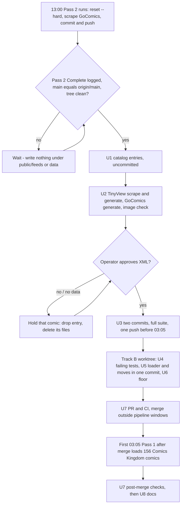

# Catalog Sweep Follow-Through and Comics Kingdom Political Loader - Plan

## Goal Capsule

- **Objective:** Every comic comiccaster.xyz lists has a feed that updates when the comic publishes. That includes the six comics found in the 2026-09-28 catalog sweep and every Comics Kingdom editorial cartoonist on the Political tab. No Comics Kingdom or GoComics catalog entry can be skipped by the loader that builds its feed.
- **Means:** The new comics ship today as catalog data. Both Comics Kingdom loaders read both catalogs through one shared helper (KTD1), and tests enforce catalog placement (R8, R9).
- **Authority:** Requirements win on behavior, KTDs win on mechanism, and units override neither. The operator's XML preview approval gates U3. `CLAUDE.md` governs git practice: explicit staging, green `pytest -v` before any push, and conventional commits.
- **Stop and ask when:**
  - the TinyView login fails or its Chrome profile is locked;
  - a rebase conflicts;
  - a new test in U4 cannot be made to fail for its stated reason;
  - a moved entry's item guids or titles would change (R7);
  - the first Pass 1 after merge opens a Comics Kingdom invariant issue.
- **Execution profile:** The work runs in two tracks, then documentation.
  - **Track A (U1-U3)** is an operational run on the pipeline host today. It happens between the end of Pass 2 (13:00) and the start of Pass 1 (03:05).
  - **Track B (U4-U7)** is code in a separate git worktree, shipped through a PR.
  - **U8** documents both tracks.
- **Who finishes:** The implementing agent does U1-U8. The operator approves the feed preview (U2) and the PR merge (U7).

---

## Product Contract

### Summary

Add Skull Pizza, Kowal Comics, Mr. Lovenstein, Boids Adventures and Graphic Rage (TinyView), plus Sour Grapes (GoComics), and publish their feeds after operator preview. Fix the Comics Kingdom scraper and generator so they build feeds for Comics Kingdom comics in either catalog, and make each comic live in exactly one catalog. Add tests that fail when a catalog lists a comic no loader builds, and document the sweep method and the bug.

### Problem Frame

Each `public/*_comics_list.json` catalog does two jobs. It is a website tab listing, and it is the input a Source's loaders read. Nothing kept those two roles in step.

**The sweep.** The discovery scripts that last expanded the TinyView catalog (Nov 2025) were deleted in the 2026-03-20 cleanup. No sweep ran for ten months. The 2026-09-28 sweep, done by hand from each source's public listing, found:
- five active TinyView series and one GoComics strip we don't carry;
- a bug: six Comics Kingdom editorial cartoonists are listed on the Political tab, but their feeds 404 on the live site.

**The bug.** `scripts/comicskingdom_scraper_individual.py` and `scripts/generate_comicskingdom_feeds.py` each read only `public/comics_list.json`, so Comics Kingdom entries in `public/political_comics_list.json` are never scraped. In March 2026 Mallard Fillmore was "fixed" by copying it into the daily list, which left a one-off duplicate. Brilliant Mind of Edison Lee is duplicated the same way.

**The pattern.** This is at least the fourth case of catalog lists drifting apart:
- GoComics generator reading a stale catalog: `docs/plans/2026-05-16-001-fix-dual-catalog-source-of-truth-plan.md`.
- Spanish filter desync: `docs/solutions/ui-bugs/spanish-ui-filter-missing-comics-source-list-mismatch.md`.
- Slug collision: `docs/solutions/logic-errors/two-sources-one-feed-file-slug-collision.md`.

The 2026-05-16 reader inventory listed both Comics Kingdom loaders but checked only their `comics_list.json` reads, so the political gap survived that fix.

### Requirements

**New comics**
- R1. The TinyView catalog includes Skull Pizza (`skullpizza`, Steve Lewis), Kowal Comics (`kowal-comics`, Steph Kowal), Mr. Lovenstein (`mrlovenstein`, J. L. Westover), Boids Adventures (`boids`, Dave McElfatrick) and Graphic Rage (`graphic-rage`, Aubrey Hirsch). Each slug equals its upstream TinyView path.
- R2. The daily catalog includes Sour Grapes (`sour-grapes`, Tim Jones) as a GoComics comic.
- R3. No new feed reaches main before the operator has previewed its XML. A new comic with no scraped data today is held out of the catalog commit rather than published unpreviewed. Graphic Rage is the one exception: it has not posted inside the scraper's 30-day window, so it ships listed without a feed until it next posts.

**Comics Kingdom loading**
- R4. Every Comics Kingdom comic in either the daily or the political catalog is scraped daily and gets a feed. That includes `mike-smith`, `lee-judge`, `jimmy-margulies`, `david-m-hitch`, `ed-gamble` and `mike-shelton`.
- R5. No Comics Kingdom comic is scraped or generated twice in one run.

**Catalog placement**
- R6. Final placements:
  - `mallard-fillmore` lives only in the political catalog and keeps author Bruce Tinsley;
  - `brilliant-mind-of-edison-lee` lives only in the daily catalog;
  - `john-branch` and `willy-black` move to the political catalog.
- R7. Existing Comics Kingdom feeds keep their item guids and item titles through the moves, so subscribers receive nothing twice.
- R8. A test fails when any slug appears in both the daily and political catalogs. The only exceptions are four named GoComics strips: `doonesbury`, `tomthedancingbug`, `brian-mcfadden` and `think`.

**Guardrails**
- R9. A test fails when a Comics Kingdom or GoComics entry in either catalog is not returned by the loader that builds its feed.
- R10. The Comics Kingdom scrape-count floor in the invariant guard matches the new catalog size.

**Knowledge capture**
- R11. Solution docs record two things. The sweep method: where each source publishes its full comic list, and which comics are excluded on purpose. And the political-catalog loader bug, as an instance of catalog-list drift.

### Key Decisions

- **Add all five TinyView comics, including Graphic Rage.** (session-settled: user-approved — chosen over dropping Graphic Rage for posting rarely: RSS suits rare posting.) Governs R1, R3.
- **Each comic lives in exactly one of the daily and political catalogs, with Mallard Fillmore folded in.** (session-settled: user-directed — chosen over leaving Mallard Fillmore duplicated as a one-off: no dangling exceptions.) Governs R6, R8.
- **John Branch and Willy Black move to the Political tab.** (session-settled: user-directed — chosen over leaving them on the Daily tab: Comics Kingdom files them as political.) Governs R6.
- **Doonesbury, Tom the Dancing Bug, Brian McFadden and Think stay on both tabs as named exceptions.** (session-settled: user-directed — chosen over moving them to Political only, or limiting the rule to Comics Kingdom.) Governs R8.
- **Dormant Ed Gamble and Mike Shelton stay in the catalog.** (session-settled: user-directed — chosen over removing them: a dead link is acceptable.) Governs R4.
  - **Conflict call-out:** research found these links will not stay dead. Comics Kingdom serves a comic's last strip for any date, so after the fix both get a feed showing their final strip dated on the day it was scraped. Roughly 90 days later they join the re-delivery bug tracked in #207.

### Success Criteria

- The day after the PR merges, the live feeds for `mike-smith`, `lee-judge`, `jimmy-margulies` and `david-m-hitch` return HTTP 200 with current strips.
- New TinyView and Sour Grapes feeds are live with content the operator previewed, and the site lists the comics.
- The first Pass 1 after merge reports success with no pipeline-failure issue opened.

### Scope Boundaries

- Dormant feeds on any source stay as they are. That covers the 14 TinyView and 93 GoComics catalog entries with no recent strips.
- Comics Kingdom's "vintage" source variant and date handling are untouched here. Both belong to #207.
- The GoComics loader and its cross-listing behavior are unchanged apart from the R8 allowlist.

#### Deferred to Follow-Up Work

- **Monthly automated discovery sweep:** a scheduled check on the pipeline host that opens a GitHub issue when a source lists comics we don't carry. It gets its own plan. (session-settled: user-directed — chosen over a doc-only method or an on-demand script: the real failure was remembering to sweep.)
- **#207, stale strips:** dormant Comics Kingdom feeds re-deliver the same strip daily, and vintage feeds are stuck on one image. (session-settled: user-approved — chosen over fixing it in this PR: different root cause, smaller PR.)
- **Single-item TinyView feeds:** each feed carries only the newest item, because `scripts/generate_tinyview_feeds_from_data.py` reads only the latest data file and rewrites the feed. No issue exists yet.
- **30-day TinyView lookback:** `comiccaster/tinyview_scraper.py` caps its lookback at 30 days, which is why Graphic Rage starts without a feed.
- **`AGENTS.md` inaccuracy:** it calls every generator network-free, but `scripts/generate_comicskingdom_feeds.py` falls back to a live fetch for a slug with no scraped data.

### Sources

- `scripts/generate_gocomics_feeds.py` `load_comics_catalog()`: the two-catalog loading pattern to mirror.
- `tests/test_generate_gocomics_feeds.py` `TestCatalogPath`: the loader-coverage test pattern.
- `tests/test_catalog_source_integrity.py`: where the catalog invariants live, and the readable-failure style to follow.
- `comiccaster/loader.py`: not reusable. Its validator rejects `comicskingdom`, it rewrites `source`, and nothing in production calls it.
- `scripts/local_pass2_update.sh`: runs `git reset --hard origin/main` unconditionally at 13:00, then `git add -f public/feeds/*.xml`.
- `docs/solutions/logic-errors/pipeline-silent-failure-on-wrong-branch.md`: never leave the main checkout on a branch.
- `docs/solutions/logic-errors/silent-empty-scrape-passed-as-success.md`: `SOURCE_RULES` floors should be re-checked whenever a catalog changes.
- `docs/solutions/best-practices/scrapers-must-use-build-chrome-driver.md`: TinyView driver behavior during a manual run.
- The 2026-09-28 sweep evidence and the #207 issue body.

---

## Planning Contract

### Key Technical Decisions

- KTD1. **One shared Comics Kingdom catalog helper in `comiccaster/`, used by both the scraper and the generator.** (session-settled: user-directed — chosen over duplicating political entries into `public/comics_list.json` the way Mallard Fillmore was patched: fix the loader, not the data.)
  - The two scripts carried identical private loaders that drifted together. One helper means one place to be right.
  - It mirrors `scripts/generate_gocomics_feeds.py` `load_comics_catalog()`: it reads both `public/` catalogs, and a missing political file is logged, not fatal.
  - It keeps the existing `source == 'comicskingdom'` ownership filter.
  - It is Comics Kingdom-scoped, not a general catalog abstraction; the GoComics loader stays as is. Governs R4.
- KTD2. **The helper de-duplicates by slug at runtime.** When a slug is in both lists, it keeps the daily-catalog entry and logs a warning. R8's test keeps the catalogs clean; this guard means a future slip degrades to a warning instead of a double scrape. Governs R5.
- KTD3. **The R8 allowlist is keyed on the slug plus GoComics ownership in both lists.** A Comics Kingdom slug can never be allowlisted, since that would bring the double scrape back. An allowlisted slug that is no longer in both lists also fails the test, so the list cannot go stale.
- KTD4. **The loader change and the catalog moves land in one commit, and are only ever reverted together.** Each half alone is broken:
  - Loader first: `mallard-fillmore` and `brilliant-mind-of-edison-lee` are scraped twice, and Edison Lee's feed flips to political.
  - Moves first: `mallard-fillmore`, `john-branch` and `willy-black` stop being scraped, and their feeds freeze.
- KTD5. **Moved entries keep `name` exactly.** Item titles are built from `name`, and guids come from scraped strip URLs, so neither changes (R7). What does change is channel metadata:
  - The move sets `is_political: true`, which switches the channel description and category to the political variant.
  - Mallard Fillmore's political entry gains `author: "Bruce Tinsley"`.
  - John Branch's `url` becomes `https://comicskingdom.com/john-branch`, replacing the `?post_type=ck_comic&p=…` form.
  - Edison Lee keeps its daily entry and name, so its feed does not change.
- KTD6. **The catalog additions go straight to main today; the Comics Kingdom code goes through a branch in a separate git worktree and a PR.** (session-settled: user-approved — chosen over one combined PR: the new comics go live today while the code change gets CI.) The worktree exists because both pipeline passes reset whatever branch the main checkout has checked out.
- KTD7. **Nothing is written under `public/feeds/` or `data/` until Pass 2 has logged completion, and Track A is pushed before 03:05.** An untracked feed file survives `git reset --hard` and gets swept into the next pass's `git add -f`. That would ship it without a catalog entry or a preview. Pushes and the merge also avoid 13:00-13:05 and 03:05-03:45.
- KTD8. **Build Track A in the repo with the pipeline's own commands, not in a scratch copy.**
  - Run from the repo root with the pipeline venv and `.env`, as `scripts/local_master_update.sh` does.
  - The TinyView scraper will overwrite `data/tinyview_2026-09-28.json`, dropping its one `itchy-feet` record from 09-27. Tomorrow's run re-scrapes that strip under the same guid, so subscribers don't see it twice.
  - Rejected: a scratch-copy run, which would need a second full scrape to land the data. Also rejected: backing up and merging data files, which `docs/LOCAL_AUTOMATION_README.md` says not to hand-edit.
  - Any backup lives outside `data/`, because the generator picks the filename that sorts last.
- KTD9. **Sour Grapes' feed is built locally from Pass 2's data using the network-free GoComics generator, and only `public/feeds/sour-grapes.xml` is kept.** Every other regenerated GoComics feed differs only in `lastBuildDate` and is discarded.
  - The GoComics scraper never reads the catalog. It captures only comics on the account's configured favorites pages. The operator added Sour Grapes to a daily favorites page on 2026-09-28, after that morning's Pass 1, so no data file before Pass 2 can contain it.
  - If Pass 2 did not capture `sour-grapes`, the catalog entry is held (R3), and the hold note says it was not updated at scrape time. The rolling backfill covers political pages only, so the comic's first data depends on it being updated when a pass scrapes. Any later pass that captures it can build the feed.
- KTD10. **The Comics Kingdom scrape floor rises from 140 to 146, and its note reads "catalog of 156".** That keeps the ratio at about 94%. After the fix the helper returns 147 daily plus 9 political entries, 156 unique slugs. Governs R10.
- KTD11. **The preview checks images, not just text,** because the operator's XML viewer does not render them. Every new item's image URL path must contain that comic's slug and strip date, and must fetch as an image. `comiccaster/tinyview_scraper.py` falls back to any `*.tinyview.com` lazy-loaded image, so the wrong art would otherwise pass a text-only check.

### High-Level Technical Design

The design is mostly sequencing across processes: two pipeline passes that reset the repo, a manual build, an operator gate, and a PR.

Catalog placement before and after Track B:

| Slug | Before | After |
|---|---|---|
| `mallard-fillmore` | daily + political | political (author carried over) |
| `brilliant-mind-of-edison-lee` | daily + political | daily |
| `john-branch` | daily | political |
| `willy-black` | daily | political |
| `mike-smith`, `lee-judge`, `jimmy-margulies`, `david-m-hitch`, `ed-gamble`, `mike-shelton` | political (never loaded) | political (loaded) |
| `doonesbury`, `tomthedancingbug`, `brian-mcfadden`, `think` | daily + political | unchanged (allowlisted) |

### Risks

| Risk | Mitigation |
|---|---|
| TinyView login fails, or Monday's reauth left Chrome holding the profile | The scraper exits before writing anything. Confirm no Chrome process holds `~/.tinyview_chrome_profile` before U2. Kill a hung run well before 03:05, or Pass 1's TinyView scrape fails. |
| A new series stores its images under an unexpected CDN folder: zero entries, or the wrong art | Watch the scrape log for "No comic images found". KTD11 catches wrong art. Hold that series out (R3). |
| A push collides with a pipeline pass, triggering its reset-and-regenerate recovery | Push only outside the pipeline windows (KTD7). After pushing, fetch, then confirm HEAD is an ancestor of `origin/main`. |
| Comics Kingdom session failure on the first Tuesday after merge. Past session failures cluster on Tuesday and Wednesday. | The six new slugs would hit the generator's live-fetch fallback. Re-check their feeds after the first two Pass 1 runs after merge. |
| OPML bundles count a catalogued slug as available even without a feed file (`functions/generate-opml.js`) | Graphic Rage is accepted (R3). Every other new comic ships its catalog entry and its feed in the same push. |
| Ed Gamble and Mike Shelton show a stale strip dated today, then start re-delivering it around day 90 | Accepted per the Key Decision; tracked in #207. |

---

## Implementation Units

### U1. Add the six new comics to the catalogs

- **Goal:** Catalog entries for the sweep's new comics.
- **Requirements:** R1, R2; R3 decides whether each entry survives to the commit.
- **Dependencies:** Pass 2 has completed (KTD7).
- **Files:** `public/tinyview_comics_list.json`, `public/comics_list.json`; guarded by `tests/test_catalog_source_integrity.py` (existing, unchanged).
- **Approach:**
  1. Add five TinyView entries in the file's key order: `name`, `slug`, `author`, `url`, `source: "tinyview"`.
     - Place each in `name` order.
     - `url` is `https://tinyview.com/<slug>`.
     - Use plain names; the "(TinyView)" suffix is reserved for artists who also appear under GoComics.
  2. Append Sour Grapes to the end of `public/comics_list.json`:
     - `name`, `author: "Tim Jones"`, `url: "https://www.gocomics.com/sour-grapes"`, `slug`;
     - `position: 571`, which is the maximum plus one (the last entry is not the maximum);
     - `is_updated: true`, and no `source` field.
  3. Keep the files' formatting: 2-space indent and a trailing newline.
- **Patterns to follow:** commit `755c2e583c` (Deogie! and Student Bill); the `the-ancients` and `street-scene` appends in #140.
- **Test scenarios:**
  - Test expectation: no new test. These are data-only entries, and the existing invariants cover them: every entry has a known source, the url host matches the source, and no slug is claimed by two sources.
- **Verification:** The catalog integrity tests pass, and each of the six slugs appears exactly once across all catalogs.

### U2. Build, verify, and preview the new feeds

- **Goal:** Feed XML for the new comics from real data, signed off by the operator.
- **Requirements:** R1, R2, R3.
- **Dependencies:** U1, uncommitted is fine.
- **Files:**
  - `data/tinyview_2026-09-28.json` (rewritten by the scraper);
  - new `public/feeds/skullpizza.xml`, `kowal-comics.xml`, `mrlovenstein.xml`, `boids.xml` and `sour-grapes.xml`;
  - `data/comics_2026-09-28.json` (read only).
- **Approach:**
  1. Check preconditions:
     - the Pass 2 log shows completion;
     - after a fetch, main equals `origin/main` and the tree is clean;
     - no Chrome process holds the TinyView profile.
  2. Run the pipeline's TinyView scrape and then the TinyView generator, the same way `scripts/local_master_update.sh` does (KTD8).
     - The pipeline passes a 90-day listing window, but the scraper only fetches strips from the last 30 days (see R3).
     - Note any series the log reports as "No comic images found".
  3. Confirm `sour-grapes` is in today's GoComics data.
     - If it is, run the GoComics generator and keep only the new file (KTD9).
     - If not, remove the Sour Grapes entry from U1 (R3).
  4. List the new and changed files.
     - Remove from U1, and delete the stray files of, any new TinyView series other than `graphic-rage` that produced no items.
     - Existing TinyView feeds the generator rewrote carry strips that are new since Pass 1, and those strips are in the rewritten data file. Keep them, and ship them with that data file in U3. They need no preview, because R3 gates new feeds only.
     - Discarding them while committing the data file would lose those strips for good. The scraper skips any strip already recorded in `data/`, and the generator reads only the latest data file.
  5. Run the image check (KTD11) on every new item.
  6. Send the raw XML of each new feed to the operator, and hold until approved.
  7. If approval has not arrived by 02:30, back everything out before Pass 1 can publish it (KTD7):
     - delete every untracked file this unit created under `public/feeds/` and `data/`;
     - restore the tracked files it changed, including the uncommitted catalog edits;
     - confirm the tree is clean;
     - resume Track A after the next Pass 2.
- **Execution note:** This is an operational run of existing, unchanged code on the pipeline host. Judge it by the data file and the XML, not by exit codes.
- **Test scenarios:**
  - Test expectation: none. No code changes; the Verification below stands in for unit coverage.
- **Verification:**
  - Today's TinyView data holds entries for every new series except `graphic-rage`.
  - Each new XML has at least one item that passes KTD11.
  - The operator has approved.
  - No untracked file outside the approved set remains under `public/feeds/` or `data/`.

### U3. Ship the catalog and feed data to main

- **Goal:** The new comics go live in a single deploy.
- **Requirements:** R1, R2, R3.
- **Dependencies:** U2 approval.
- **Files:** `public/tinyview_comics_list.json`, `public/comics_list.json`, `data/tinyview_2026-09-28.json`, and the approved `public/feeds/*.xml`.
- **Approach:**
  1. Discard the `lastBuildDate`-only changes to existing GoComics feeds from the local GoComics generator run. Keep the TinyView generator's rewrites of existing feeds, per U2 step 4.
  2. Run the full suite and confirm it is green.
  3. Make two commits with explicitly staged paths, per `CLAUDE.md`: the catalog additions first, then the data and feeds.
  4. Rebase onto `origin/main`, then push once, outside the pipeline windows and before 03:05 (KTD7).
  5. Fetch, confirm HEAD is an ancestor of `origin/main`, and confirm the tree is clean.
- **Test scenarios:**
  - Test expectation: none. No code; the full suite is the gate.
- **Verification:**
  - The deployed site serves each new feed URL with HTTP 200 (`graphic-rage` excepted per R3).
  - The TinyView and Daily tabs list the new comics.

### U4. Failing guard tests for catalog placement and Comics Kingdom loading

- **Goal:** Write R5, R8 and R9 as tests before the fix.
- **Requirements:** R4, R5, R8, R9.
- **Dependencies:** A worktree branch cut from `origin/main` after U3 lands, so the catalogs already include U1.
- **Files:** `tests/test_catalog_source_integrity.py`, new `tests/test_generate_comicskingdom_feeds.py`, `tests/test_comicskingdom_scraper.py`.
- **Approach:**
  1. In the integrity suite, add a daily-versus-political overlap test with the allowlist per KTD3. Also add a coverage test: every Comics Kingdom entry in either catalog is returned exactly once by the loaders. The existing `TestCatalogPath` already covers GoComics loader coverage.
  2. Add generator loader tests modeled on `TestCatalogPath`: `chdir` to the project root, and compute expected counts from the `public/` files, never hard-coded.
  3. Add a scraper loader test next to the existing ones.
  4. Mock the generator's live fetch (`requests` / `extract_live_comicskingdom_entries`) in every generator test, and use `tmp_path` for `data/` and `public/feeds/`.
- **Execution note:** Write the tests first. Confirm each one fails against current code and catalogs for its stated reason before starting U5.
- **Patterns to follow:**
  - `tests/test_catalog_source_integrity.py` (`_entries()`, failure lists that name the offending slugs);
  - `tests/test_generate_gocomics_feeds.py` `TestCatalogPath`;
  - the `sys.path` import style in `tests/test_comicskingdom_scraper.py`.
- **Test scenarios:**
  - Happy path: both Comics Kingdom loaders return every Comics Kingdom slug from both catalogs exactly once (156 after U5).
  - Happy path: `mike-smith`, `lee-judge`, `jimmy-margulies`, `david-m-hitch`, `ed-gamble` and `mike-shelton` are in both loaders' output.
  - Edge case: a Comics Kingdom slug in both catalogs fails the overlap test by name, even if someone adds it to the allowlist.
  - Edge case: an allowlisted GoComics slug in both catalogs passes, and a non-allowlisted GoComics slug in both fails.
  - Edge case: an allowlisted slug that is no longer in both catalogs fails, flagging the allowlist as stale.
  - Error path: given synthetic catalogs in `tmp_path` with one slug in both, the helper returns the daily entry once and logs a warning (KTD2).
  - Error path: with the political catalog missing, the helper returns the daily Comics Kingdom entries and logs, without raising.
  - Integration: generator `main` run over a `tmp_path` data dir with scraped data for a political-only slug writes that slug's feed carrying the political category, and makes no network call.
- **Verification:** Before U5, each new test fails for its stated reason and all existing tests still pass.

### U5. Shared Comics Kingdom catalog helper and catalog moves

- **Goal:** Both Comics Kingdom scripts load from both catalogs, and the catalogs follow the placement rules.
- **Requirements:** R4, R5, R6, R7.
- **Dependencies:** U4.
- **Files:**
  - a new small module in `comiccaster/` holding the helper;
  - `scripts/comicskingdom_scraper_individual.py`, `scripts/generate_comicskingdom_feeds.py`;
  - `public/comics_list.json`, `public/political_comics_list.json`;
  - tests from U4.
- **Approach:**
  1. Add the helper per KTD1 and KTD2.
  2. Replace both scripts' private catalog loaders with the helper, keeping each script's existing behavior after loading.
  3. Apply the catalog moves in the table above, per R6 and KTD5.
  4. Land all of it as one commit (KTD4).
- **Patterns to follow:** `scripts/generate_gocomics_feeds.py` `load_comics_catalog()`.
- **Test scenarios:**
  - Happy path: all U4 tests pass.
  - Integration: generating `mallard-fillmore` from existing data after the move produces the same item guids and titles as the current `public/feeds/mallard-fillmore.xml` (R7).
  - Integration: the regenerated `brilliant-mind-of-edison-lee` feed carries no political category.
  - Integration: `john-branch` and `willy-black` keep their item guids and titles, and their channels switch to the political description.
- **Verification:** The full suite is green, and item guids for the moved comics are unchanged before and after.

### U6. Scrape-count floor and stale counts

- **Goal:** The invariant guard's Comics Kingdom floor reflects 156 comics.
- **Requirements:** R10.
- **Dependencies:** U5.
- **Files:** `scripts/check_scrape_counts.py`; `tests/test_check_scrape_counts.py` (only if a value there depends on the rule); `docs/STATUS.md`; the "152 of 153" comment in `scripts/comicskingdom_scraper_individual.py`.
- **Approach:**
  1. Apply KTD10.
  2. Add a dated line to the existing comment that narrates the floor's history, stating why it moved.
  3. Update the Comics Kingdom feed counts and the count-history line in `docs/STATUS.md`, and rewrite the "152 of 153" comment in `scripts/comicskingdom_scraper_individual.py`. Use the post-fix totals: 147 daily, 9 political, 156 combined.
- **Test scenarios:**
  - Edge case: a Comics Kingdom data file with 145 entries fails the check, and one with 146 passes. Follow the style `tests/test_check_scrape_counts.py` already uses.
- **Verification:** The scrape-count tests pass, and no remaining text claims a catalog of 150 or 153.

### U7. PR, merge, and post-merge verification

- **Goal:** Ship the Comics Kingdom fix and prove R4 in production.
- **Requirements:** R4, R5, R7, R10.
- **Dependencies:** U4-U6; U3 already on main, with the branch rebased onto it.
- **Files:** none new.
- **Approach:**
  1. Open the PR from the worktree branch. The body links #207 and records the catalog moves. CI (`tests.yml`) must be green.
  2. Merge outside the pipeline windows (KTD7). Any revert takes the whole change (KTD4).
  3. Remove the worktree, and confirm the main checkout is on `main` and clean.
  4. After the first Pass 1 after merge, check:
     - the Comics Kingdom log reports loading 156 comics;
     - that day's Comics Kingdom data holds 156 unique slugs. 154 is acceptable if Comics Kingdom returns no strip for the dormant `ed-gamble` and `mike-shelton`; the 146 floor still applies;
     - feed files exist for the six previously-missing slugs;
     - `mallard-fillmore` still has every guid it had before;
     - `brilliant-mind-of-edison-lee` has no political category;
     - no pipeline-failure issue was opened.
  5. Repeat the new-slug feed check after the Pass 1 after that.
  6. If the merge lands after 03:05 on 2026-09-29, tell the operator the fix goes live a day later. The checks simply move to the next Pass 1, and seeing pre-fix output from runs before the merge is not a failure.
- **Test scenarios:**
  - Test expectation: none. This is a release and verification unit.
- **Verification:** The live feeds for `mike-smith`, `lee-judge`, `jimmy-margulies` and `david-m-hitch` return HTTP 200 with current strips.

### U8. Solution docs and catalog vocabulary

- **Goal:** The next session inherits the sweep method and the lesson of this bug.
- **Requirements:** R11.
- **Dependencies:** U7, for the evidence and PR number.
- **Files:**
  - a new doc under `docs/solutions/logic-errors/` for the political-catalog loader bug;
  - a new doc under `docs/solutions/best-practices/` for the catalog discovery sweep;
  - `CONCEPTS.md`.
- **Approach:**
  1. Use the frontmatter shape of the 2026-08 docs: `module`, `problem_type`, `tags` and `applies_when`.
  2. **The bug doc:**
     - frame it as catalog-list drift, and note that the 2026-05-16 inventory checked only the `comics_list.json` readers;
     - link the dual-catalog plan, the slug-collision doc, the Spanish-desync doc and #207.
  3. **The sweep doc** records, per source:
     - where the full list lives: TinyView's embedded series registry and per-series `index.json`; the GoComics A-to-Z and political A-to-Z pages with `updatedToday`; the Comics Kingdom `/features` page; the Creators "all" listing plus `data/creators_discovery_report.json`;
     - the comics excluded on purpose (Lunarbaboon on GoComics; Broom Hilda, Pluggers and Shoe on Comics Kingdom);
     - the 30-day TinyView lookback;
     - a pointer to the planned monthly automation.
  4. Add a `Catalog` entry to `CONCEPTS.md`. It records that each catalog file is both a website tab listing and a loader input, and that the Spanish list is a derived view.
- **Test scenarios:**
  - Test expectation: none. Documentation only.
- **Verification:** Both docs link their evidence, and the `CONCEPTS.md` entry follows the file's existing format.

---

## Verification Contract

| Gate | Command | Applies to |
|---|---|---|
| Catalog invariants | `venv/bin/python -m pytest tests/test_catalog_source_integrity.py -v` | U1, U4, U5 |
| Comics Kingdom loaders | `venv/bin/python -m pytest tests/test_generate_comicskingdom_feeds.py tests/test_comicskingdom_scraper.py -v` | U4, U5 |
| Scrape-count floor | `venv/bin/python -m pytest tests/test_check_scrape_counts.py -v` | U6 |
| Full suite (offline, with coverage per `pytest.ini`) | `venv/bin/python -m pytest -v` | before every push (U3, U7) |
| CI | `.github/workflows/tests.yml`, Python 3.10, 3.11 and 3.12 | U7 |
| Push landed | fetch, then check that HEAD is an ancestor of `origin/main` | U3, U7 |

No test may hit a live comic source. Tests of the Comics Kingdom generator mock its live-fetch fallback.

---

## Definition of Done

- Every requirement R1-R11 is met, or explicitly held under R3 with the operator told which comic was held and why.
- Track A shipped before 03:05 on 2026-09-29, with nothing in `public/feeds/` or `data/` left untracked.
- The PR is merged, and the post-merge checks in U7 pass on the first Pass 1 after merge and on the one after that.
- The main checkout is on `main` and clean, and the worktree is removed.
- No abandoned-attempt code is left in the diff, and every new test runs offline.

| Unit | Done when |
|---|---|
| U1 | The six entries exist and the integrity tests pass. |
| U2 | The operator approved the XML, and the image check passed for every new item. |
| U3 | Both commits are on `origin/main` and the new feeds serve HTTP 200 (`graphic-rage` excepted per R3). |
| U4 | The new tests exist and fail for their stated reasons on the pre-fix code. |
| U5 | The helper and moves landed in one commit, the full suite is green, and the moved comics' guids are unchanged. |
| U6 | The floor is 146, the note says 156, and the stale counts are gone. |
| U7 | Merged, and the checks pass on the first two Pass 1 runs after merge. |
| U8 | Both solution docs and the `CONCEPTS.md` entry are merged. |
