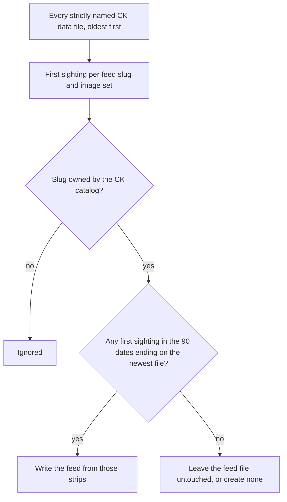

# Comics Kingdom First-Sighting Strip Identity - Plan

## Goal Capsule

- **Objective:** A Comics Kingdom subscriber receives each strip once. Dormant, weekly and vintage comics stop re-sending strips the subscriber already has under a new date, and no strip already in a feed changes identity.
- **Means:** Date each strip by its first sighting anywhere in saved Comics Kingdom history and list only strips first seen in the last 90 days (KTD1-KTD3), from a network-free generator that leaves a feed with nothing new untouched (KTD4).
- **Authority:**
  - Requirements win on behavior, KTDs win on mechanism, and units override neither.
  - The operator's approval of the feed preview gates the PR (U4), and the operator merges.
  - `CLAUDE.md` governs git practice: explicit staging, green `pytest -v` before any push, conventional commits, code and feed data committed separately.
- **Stop and ask when:**
  - the continuity proof in U4 shows a kept item whose guid, title, pubDate or link changed, an item a feed did not already list, or a rewritten frozen feed (R4, R5);
  - any CK data file fails to parse during U4, since a skipped file moves first sightings (R7);
  - the post-merge watch in U5 finds a re-delivered strip;
  - a rebase conflicts.
- **Execution profile:**
  - U1-U4 are code in the git worktree `worktrees/ck-first-sighting-identity` on branch `fix/ck-first-sighting-identity`, shipped through a PR. The main checkout stays on `main`.
  - Merge outside the pipeline windows (Pass 1 03:05-03:30, Pass 2 13:00-13:10). No catch-up run is needed, because the next Pass 1 regenerates every CK feed.
  - U5 is a read-only watch of the next two Pass 1 runs. U6 records the learning on `main`.
- **Who finishes:** The implementing agent does U1-U6. The operator approves the preview and merges the PR.

---

## Product Contract

### Summary

Change the Comics Kingdom generator so each strip has one permanent identity and date: the first time its image set appears anywhere in saved CK data. A feed lists only strips first seen in the 90 days up to the newest data file, and a feed with nothing to list keeps its file exactly as it is. The generator stops making network calls, and the docs state that CK data history must stay append-only.

### Problem Frame

Comics Kingdom feeds re-send strips subscribers already have (issue #207). Comics Kingdom serves its newest post for any date, so the scraper saves the same strip every night under that night's address, `comicskingdom.com/<slug>/<scrape date>`, and that address becomes the item's guid. The generator dedups images only within the 90 newest data files. When a strip's earliest copy leaves that window, the next night's copy becomes the first one, with a new guid, and readers get the strip again. A dormant or vintage comic does this every night, and a weekly comic does it once for each extra night a strip stayed up.

Replaying the current rule over 2026-09-01 to 2026-10-01 gives 1,858 re-delivered items, about 60 a night, one per affected feed. For example, `mostly-gravy` first showed an image on 2026-06-29. On 2026-10-01 its feed gained the guid `https://comicskingdom.com/mostly-gravy/2026-07-03` for that image, after `.../2026-07-02` fell out of the window.

TinyView had the sibling bug, fixed in #212 by giving strips a stable identity and windowing by strip date. GoComics does not have it: each GoComics record's address carries the publisher's own date, so the same strip always gets the same guid.

### Requirements

**Feed items**

- R1. Within one feed, a strip's identity is its image set, and the same image set never appears under a second guid.
- R2. Each strip's guid, title, pubDate, link and description come from its first-sighting record, derived exactly as items are derived today.
- R3. A feed lists every strip first sighted within the 90 days ending on the newest CK data file's date: that date and the 89 before it.
- R4. A feed with no strip to list keeps its existing file byte-identical. The generator never writes an empty feed and never creates a new file for such a comic.
- R5. At rollout, no item that stays in a feed changes its guid, title, pubDate or link, and no feed gains an item it did not already list.

**Generator robustness**

- R6. The CK generator makes no network calls.
- R7. An unreadable or malformed CK data file or record is skipped with a warning that names it, and generation continues.
- R8. The generator reads only data files named `comicskingdom_YYYY-MM-DD.json` and writes feeds only for comics the CK catalog owns.

**History rule**

- R9. The docs state that saved CK data history is append-only: no past-date scrapes, no relabeling records after a feed ships, and no deleting old CK data files. The rule names Comics Kingdom only and says GoComics merges and backfills stay safe. It is documented, not enforced in code.

### Key Decisions

- **Fix re-deliveries now and the vintage feeds later.** Vintage feeds stuck on one strip, and the scraper's repeat copies, go to #216. (session-settled: user-directed — chosen over fixing vintage in the same PR and over running live checks first: a constrained fix that sets up the vintage work.) Governs R1, R2, R3, R4, R5.
- **Feeds with nothing new keep their current item.** The 37 feeds with no strip first sighted in the window on 2026-10-01 (32 vintage, 5 dormant) stay as they are, each with one item dated wherever it had drifted. (session-settled: user-approved — chosen over rewriting those items once with their true first-sighting date, which would re-deliver each one once.) Governs R4.
- **Skip an unreadable data file.** Skipping one in-window day drops about 85 strips from feeds and re-delivers 4-13 non-daily strips once. (session-settled: user-approved — chosen over stopping CK generation, which would freeze all 156 feeds with no alert, because generation failures are only logged.) Governs R7.
- **Document the history rule for Comics Kingdom only, with no code guard.** (session-settled: user-approved — chosen over a code guard and over a rule for every source: GoComics records carry the publisher's date, and its last 90 data files hold 22,693 records with no image under two dates.) Governs R9.

### Acceptance Examples

- AE1. Covers R1, R3, R4.
  - **Given:** a dormant comic whose only image was first sighted 2026-06-20 and saved every night since.
  - **When:** the generator runs with 2026-10-01 as the newest file, so the window starts 2026-07-04.
  - **Then:** nothing is listed, and the feed file is left byte-identical. The next night gives the same result.
- AE2. Covers R1, R2, R3.
  - **Given:** a weekly comic whose new strip was first sighted 2026-09-24 and saved again each night through 2026-09-30.
  - **When:** the generator runs on any night through 2026-12-22.
  - **Then:** the feed lists that strip once, with guid `.../2026-09-24`. After 2026-12-22 it leaves the feed, and no later copy takes its place.
- AE3. Covers R7.
  - **Given:** an in-window data file holding invalid JSON.
  - **When:** the generator runs.
  - **Then:** it logs a warning naming that file, builds every feed from the other files, and exits 0.

### Success Criteria

- Each of the first two Pass 1 runs after merge adds no CK feed item whose image set was already in saved history. The current rule adds about 60 a night.
- Those runs leave the frozen feeds' files unchanged unless their comic posts a new strip.

### Scope Boundaries

Considered and not built:

- **A code guard against past-date scrapes or history edits.** The settled call is documentation (R9). Reconsider if a history edit reaches `main` again.
- **Refreshing a frozen feed when its catalog entry changes.** A frozen feed picks up `name`, `author` or `is_political` edits only when it next lists a strip. Reconsider if such an edit has to reach a dormant comic's subscribers.
- **A data-file reader shared by the TinyView and CK generators.** Each keeps its own small reader, per the YAGNI rule in `CLAUDE.md`. Reconsider when a third generator needs the same reader.
- **A warning for catalog comics with no saved history.** It would only reach the log, for a case that does not occur today: every catalog comic has history, and a new one gets data from its first nightly scrape. Reconsider if a catalog comic ever goes a week with no feed file.
- **An alert on CK generation failures.** Feed-generation failures are log-only by design (`AGENTS.md`), and the U5 watch covers the rollout.

#### Deferred to Follow-Up Work

- Issue #216: vintage feeds stuck on one strip, the scraper saving repeat copies and whole-page captures, and the promo-image fallback.
- Recording Comics Kingdom's own post date in the scraper, also under #216. If confirmed, CK identity would stop depending on history and R9 could retire.

### Sources

- Issues #207 and #216.
- `docs/plans/2026-09-29-1307-fix-tinyview-feed-history-plan.md` and `docs/solutions/logic-errors/tinyview-feed-history-collapsed-to-one-strip.md`: the precedent this plan mirrors.
- `docs/solutions/logic-errors/two-sources-one-feed-file-slug-collision.md`: why only catalog-owned slugs get feeds, since broomhilda, pluggers and shoe still appear in old CK data.
- `docs/solutions/logic-errors/comicskingdom-political-comics-never-loaded.md`: the shared `load_comicskingdom_catalog()` is the source of truth for CK slugs.
- `CONCEPTS.md` "Feed window" and "Strip identity".

---

## Planning Contract

### Key Technical Decisions

- KTD1. **Identity is the feed slug plus the sorted tuple of image URLs.** This is the generator's existing image signature, unchanged. Across 318 files and 43,891 catalog records, no multi-image set partially overlaps another. Governs R1.
- KTD2. **First sightings come from reading every data file, oldest first.** Ordering and the window use the date in the file name, and the first record found for a signature supplies the item fields (R2). Every record's `date` equals its file's date today, and a slug appears at most once per file. Reading all 318 files, about 44,000 records, is cheap.
- KTD3. **The window is the 90 dates ending on the newest data file's date.** It starts 89 days before that date. Whenever the data has no gap, this holds exactly the 90 newest files, so the rollout adds no item (R5). Chosen over "the 90 newest files" because `CONCEPTS.md` defines the window in dates, and the two diverge after an outage. Also chosen over the TinyView generator's start of newest minus 90 days, which spans 91 dates. That extra day would put strips back into feeds at rollout, and again after any night the CK scrape fails. Governs R3.
- KTD4. **Delete the live network fallback.** `extract_live_comicskingdom_entries` is the only network call in any Phase 2 generator. It would rewrite a feed that R4 says to leave alone, and it never runs, because every catalog slug has history. The `requests` and `html` imports go with it. A catalog slug with no history gets no feed file until its first scrape. Governs R4, R6.
- KTD5. **`main()` takes the data, output and catalog directories, defaulting to today's paths.** `scripts/local_master_update.sh` and `.github/workflows/update-feeds.yml` call it with no arguments and keep working. `load_comics_list()` stays, because `tests/test_catalog_source_integrity.py` imports it. Governs R8.
- KTD6. **File naming and error handling mirror the TinyView generator.** The CK script gets its own file finder with a strict name pattern and its own reader. The reader returns no records, with a warning naming the file, when a file is unreadable or not a list. A malformed record is skipped with a warning. Governs R7, R8.

### High-Level Technical Design

How each feed is decided once first sightings are built from all history:

### Risks

- **History edits move guids.** Editing an old CK data file can change a strip's first sighting and re-deliver it. Git shows three past edits: the edge-city-classic relabel of 276 files (`8c97da6a62`), a restore after conflict markers reached `data/comicskingdom_2026-04-16.json` (`96f12e8205`), and the 02-27 file cut from 152 to 12 records (`ced5958eeb`). R9's documentation is the mitigation.
- **Exact image URLs are the identity.** If Comics Kingdom moves an unchanged strip to a new image URL, it re-delivers once per affected feed. That is already true today. It also applies to #216, where any scraper change to the recorded URLs re-delivers the same way.
- **A genuine republish with an identical image URL is never listed again.** 128 slug and image-set pairs reappear after a gap today (images that flip back and forth, recovery from a placeholder image), and suppressing them is intended.
- **The pipeline cannot see a regression here.** Generation failures are only logged, and the invariant guard counts scraped records, not feed items. The continuity proof (U4) and the production watch (U5) are the gates.

---

## Implementation Units

### U1. Make the CK generator network-free

- **Goal:** Remove the live fallback so Phase 2 never reaches the network for Comics Kingdom.
- **Requirements:** R6; KTD4.
- **Dependencies:** none.
- **Files:** `scripts/generate_comicskingdom_feeds.py`, `tests/test_generate_comicskingdom_feeds.py`.
- **Approach:**
  1. Delete `extract_live_comicskingdom_entries`, its call in `generate_feed_for_comic`, and the `requests` and `html` imports.
  2. Replace the `offline` fixture in `TestMainGeneratesPoliticalFeeds`, which patches the deleted names, with an assertion that the module has no `requests`. Update the module docstring that describes the fixture.
- **Test scenarios:**
  - The generator module has no `requests` attribute and no live-fetch function.
  - The existing political-feed `main()` test passes with no network patching.
  - A catalog comic with no data gets no feed file.
- **Verification:** The CK generator tests pass, and the script imports no network library.

### U2. Build each CK feed from first sightings in the date window

- **Goal:** Each feed lists each strip once, dated by its first sighting, and a feed with nothing to list stays untouched.
- **Requirements:** R1, R2, R3, R4, R5, R7, R8; KTD1, KTD2, KTD3, KTD4, KTD5, KTD6.
- **Dependencies:** U1.
- **Files:** `scripts/generate_comicskingdom_feeds.py`, `tests/test_generate_comicskingdom_feeds.py`.
- **Approach:**
  1. Replace `load_scraped_data` with a loader that finds strictly named files (KTD6), reads them all oldest first, and keeps each slug and image set's first-sighting record with its file date (KTD2).
  2. Anchor the window on the newest file's date (KTD3) and group the first sightings inside it by catalog slug.
  3. Build items from each first-sighting record with today's field derivation (R2). When a slug has nothing to list, skip the generator call entirely so its file stays byte-identical (R4).
  4. Give `main()` directory parameters with today's defaults, and pass the catalog directory through to `load_comicskingdom_catalog` (KTD5).
- **Execution note:** Write each scenario below as a failing test before changing the generator.
- **Patterns to follow:** `scripts/generate_tinyview_feeds_from_data.py` (`DATA_FILE_NAME`, `find_tinyview_data_files`, `read_data_file`, `load_window_strips` and its empty-feed guard), except that the window starts one day later (KTD3). `tests/test_generate_tinyview_feeds.py` (the `repo`, `save_day`, `build` and `feed_items` helpers, `TestUntouchedFeeds`, `TestItemFields`).
- **Test scenarios:**
  - Covers AE1. A strip first sighted more than 90 days before the newest file and saved every night since is not listed, and with nothing else to list, the feed file stays byte-identical.
  - Covers AE2. A strip saved on 7 consecutive nights is listed once, with the first night's url as its guid and the first night's date in its title and pubDate.
  - Running on day T, then again on T+1 with one more file holding the same image, adds no guid.
  - A strip first sighted 89 days before the newest file, on the window's first day, is listed, and one first sighted 90 days before is not.
  - The window anchors on the newest data file, not the clock: the same files give the same feed on any date.
  - The same images in a different order count as one strip.
  - A comic with no strip in the window and no existing feed file gets no new file.
  - A slug in the data but not in the CK catalog, such as `broomhilda`, gets no feed.
  - Covers AE3. An in-window file holding invalid JSON is skipped with a warning naming it, and the other files still build every feed.
  - A file holding a JSON object instead of a list is skipped with a warning naming it, and so is a record missing `url`.
  - `comicskingdom_2026-09-30_backup.json` is not read and does not anchor the window.
  - Item fields match a committed feed exactly, using literal values copied from `public/feeds/blondie.xml` (guid `https://comicskingdom.com/blondie/2026-10-01` with `isPermaLink="false"`, title `Blondie - 2026-10-01`, pubDate `Thu, 01 Oct 2026 00:00:00 +0000`).
  - `main()` with no arguments reads `data/` and `public/` and writes to `public/feeds/`, as the pipeline calls it.
- **Verification:** The CK generator, catalog-integrity and GoComics-ownership tests all pass offline.

### U3. Write down the CK history rule

- **Goal:** Anyone about to edit CK data history learns that it is load-bearing, and nobody applies the rule to GoComics.
- **Requirements:** R9.
- **Dependencies:** U2.
- **Files:** `CONCEPTS.md`, `AGENTS.md`, `scripts/comicskingdom_scraper_individual.py`.
- **Approach:**
  1. In `CONCEPTS.md` "Strip identity", add the case of a source whose address names only the night it was fetched while it serves the same strip for days, as Comics Kingdom does. Its identity is the strip's image set, dated by first sighting in saved history, which makes that history append-only. State that GoComics records carry the publisher's date, so its merges and backfills are safe.
  2. In `CONCEPTS.md` "Feed window", add that a feed with nothing in its window keeps its last file. In "Generate phase", note that the CK generator reads all saved history.
  3. Make the CK scraper's `--date` help say that a past date saves Comics Kingdom's newest post under the wrong date, and that record becomes permanent strip identity.
  4. In `AGENTS.md`, extend the generator description ("the newest snapshot, or every snapshot in the feed's window") with the all-history case.
  5. Comment on #216 with two notes. First, any scraper change that records different image URLs for an unchanged strip re-delivers one item per affected feed. Candidates: the vintage path fix, dropping whole-page captures (eye-lie-popeye saves 9-24 images, phantom-2040 saves 24-48), and filtering the `wp-content/uploads/2024/02/Feature_IMAGE.png` placeholder saved for 38 slugs between 05-05 and 06-20. Second, recording Comics Kingdom's own post date from the page's `__NEXT_DATA__` could make identity independent of history. That idea is unverified: first fetch one dormant and one vintage comic's dated page and check that the post date is the original post's, not today's.
- **Test expectation:** none -- documentation and a help string.
- **Verification:** The rule appears in `CONCEPTS.md` and the `--date` help with Comics Kingdom-only wording, and the #216 comment is posted.

### U4. Continuity proof, preview and PR

- **Goal:** Prove before merge that no published item changes and nothing new appears, then ship through a PR.
- **Requirements:** R4, R5.
- **Dependencies:** U1, U2, U3.
- **Files:** none committed. The comparison runs in scratch space.
- **Approach:**
  1. Rebase the branch onto `origin/main` so the proof runs on current data.
  2. Copy `public/feeds/` to a scratch directory, run the new `main()` with that directory as output, and compare every CK feed with its committed copy.
  3. Check against these expectations. Expect no new guid in any feed, every kept item matching in guid, title, pubDate and link, and the 37 frozen feeds byte-identical. Dropped items should be rolled-forward copies of strips first sighted before the window: a replay on gap-free data from 2026-03-15 dropped 30 across 29 feeds. Until the 2026-10-05 data file, the window holds only 89 files because 2026-07-07 is missing, so each daily feed also drops its oldest strip. On 2026-10-01 data that gives 116 drops across 113 feeds.
  4. Render the changed feeds with `scripts/preview_feeds.py --against origin/main` and send the operator the HTML page.
  5. After approval, open the PR with the proof counts, watch CI, and repeat steps 1-2 just before merge, since the data changes nightly.
- **Test expectation:** none -- this unit verifies; U2 holds the tests.
- **Verification:** The proof matches the expectations above, the operator approved the preview, and CI is green.

### U5. Watch the first two Pass 1 runs after merge

- **Goal:** Confirm in production that CK feeds stop re-delivering.
- **Requirements:** R1, R4.
- **Dependencies:** U4, merged.
- **Files:** none. The checks read git history and data only.
- **Approach:** After each of the next two Pass 1 commits, diff every CK feed against its previous committed version. Every new guid must belong to an image set first sighted that night, and a frozen feed may change only if its comic posted. Report the counts beside the pre-fix baseline of about 60 re-deliveries a night.
- **Test expectation:** none -- production observation.
- **Verification:** Two nights meet the Success Criteria.

### U6. Record the learning

- **Goal:** The next session inherits the fix, the history rule and why GoComics is exempt.
- **Requirements:** R9.
- **Dependencies:** U5.
- **Files:** `docs/solutions/logic-errors/comicskingdom-feeds-redelivered-aging-strips.md` (new), `docs/solutions/logic-errors/tinyview-feed-history-collapsed-to-one-strip.md`, `docs/solutions/logic-errors/comicskingdom-political-comics-never-loaded.md`.
- **Approach:**
  1. Write the solution doc with the repo's frontmatter (`module`, `tags`, `problem_type`). Cover the mechanism, the replay numbers, the fix, the Comics Kingdom-only history rule and why GoComics is exempt, and the U5 results.
  2. Point the two existing docs' mentions of #207 at the new doc.
- **Test expectation:** none -- documentation.
- **Verification:** The new doc and both updated links are on `main`.

---

## Verification Contract

| Gate | Command | Applies to |
|---|---|---|
| CK generator | `venv/bin/python -m pytest tests/test_generate_comicskingdom_feeds.py -v` | U1, U2 |
| Catalog ownership | `venv/bin/python -m pytest tests/test_catalog_source_integrity.py tests/test_generate_gocomics_feeds.py -v` | U2 |
| Full suite (offline, with coverage per `pytest.ini`) | `venv/bin/python -m pytest -v` | before every push |
| CI | `.github/workflows/tests.yml`, Python 3.10, 3.11 and 3.12 | U4 |
| Continuity proof | scratch regeneration compared with the committed CK feeds (U4 steps 2-3) | U4 |
| Preview | `venv/bin/python scripts/preview_feeds.py <changed feeds> --against origin/main` | U4 |
| Production watch | feed diffs after the next two Pass 1 commits | U5 |

From the worktree, run these commands with the main checkout's venv and `PYTHONPATH` set to the worktree. No test may reach comicskingdom.com.

---

## Definition of Done

- R1-R9 are met, and the Success Criteria hold for two consecutive Pass 1 runs.
- The PR is merged, the main checkout is on `main` and clean, and the worktree is removed.
- No abandoned-attempt code is left in the diff, and every new test runs offline.

| Unit | Done when |
|---|---|
| U1 | The live fallback and its imports are gone, and the CK tests pass without network patching. |
| U2 | Feeds build from first sightings in the date window, and every U2 scenario passes. |
| U3 | `CONCEPTS.md`, `AGENTS.md` and the `--date` help state the Comics Kingdom-only rule, and the #216 comment is posted. |
| U4 | The proof matches expectations, the operator approved the preview, and the PR is open with green CI. |
| U5 | Two Pass 1 runs after merge add no re-delivered strip. |
| U6 | The solution doc and the two updated links are on `main`. |
