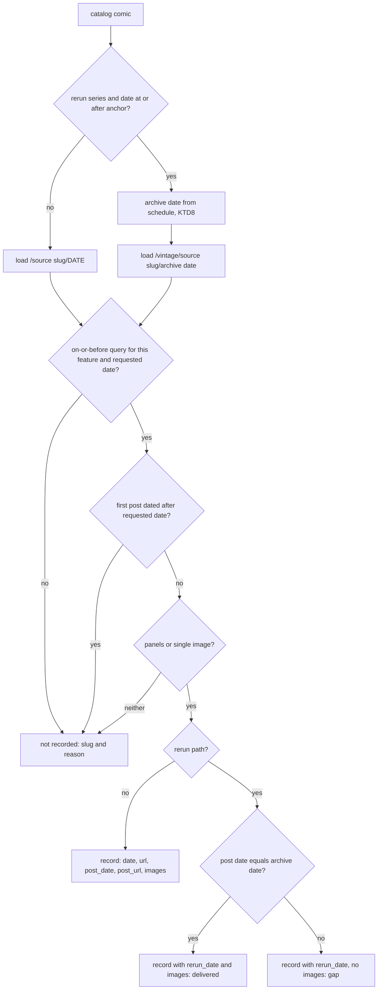
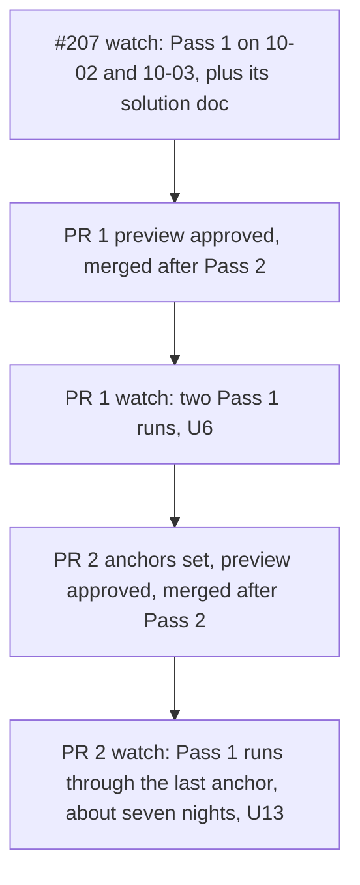

# Comics Kingdom Own-Post Recording and Vintage Reruns - Plan

## Goal Capsule

- **Objective:** Comics Kingdom subscribers get each strip once, dated as Comics Kingdom dates it, and never a feed item showing another page's images. The two episodic comics deliver each new episode. The 32 frozen vintage feeds start delivering a strip on every day their archive covers.
- **Means:** The scraper records the post the page displays, read from the page's own data (KTD1-KTD4), and the generator identifies a strip by its comic and post date (KTD5). Vintage series replay their archives on a calendar schedule that ComicCaster computes (KTD8-KTD10).
- **Authority:**
  - Requirements win on behavior, KTDs win on mechanism, and units override neither.
  - The operator approves each PR's feed preview and merges both PRs.
  - `CLAUDE.md` governs git practice: explicit staging, a green `pytest -v` before any push, conventional commits, and code kept apart from feed data.
- **Stop and ask when:**
  - the pre-switch check (U5) finds more than 10 comics not recorded, or an image mismatch outside Eye Lie Popeye and Phantom 2040;
  - a continuity proof (U5, U12) shows a kept item whose guid, title, pubDate or link changed, or a re-send it cannot explain;
  - range measurement (U7) finds a vintage series with no densely covered stretch of at least a year;
  - a post-merge watch (U6, U13) finds an unexpected new item, a spike in comics not recorded, or rerun gaps beyond the computed schedule;
  - a rebase conflicts;
  - evidence shows that a session-settled decision cannot work.
- **Execution profile:**
  - PR 1 (U1-U6) runs in the worktree `.claude/worktrees/ck-record-own-post` on branch `fix/ck-record-own-post`. PR 2 (U7-U13) runs in its own worktree on `feat/ck-vintage-reruns`, branched from PR 1's branch. The main checkout stays on `main`, because each pipeline run resets whatever branch is checked out there.
  - Live checks use the scraper's logged-in Chrome profile only outside the pipeline runs (Pass 1 from 03:05, Pass 2 from 13:00). They write to a scratch `--output-dir`, never `data/`, and end with Chrome closed. No anonymous probing: anonymous requests drew HTTP 429 on 2026-10-01.
  - Test fixtures are anonymous-shaped, with `props.pageProps.session` null. A logged-in page carries `session.accessToken` and `session.user`, so raw logged-in page source is never saved or committed. Session values are read in-process only. They never appear in output, files, command lines, environment variables, PR bodies, issue comments or docs. Measurement output holds only dates and counts.
  - Merges happen after Pass 2 and before Pass 1 (KTD12).
- **Who finishes:** The implementing agent does U1-U13. The operator approves the two previews and merges both PRs. Another agent finishes #207's post-merge watch and solution doc; this plan only waits on them.

---

## Product Contract

### Summary

PR 1 makes the Comics Kingdom scraper record the post each page displays: its own date, its address and its own images, taken from the page's embedded data instead of picked out of the rendered page. Feeds then identify and date each strip by its post. PR 2 turns the 32 vintage series whose archives no longer change into daily reruns that walk each archive on a schedule ComicCaster computes. It keeps one page load per comic per night, and documents how the schedule is built.

### Problem Frame

Issue #216 named three scraper defects. A live check on 2026-10-01 measured them and found two more facts. Findings comment: https://github.com/adamprime/comiccaster/issues/216#issuecomment-5935997323.

**The scraper records the page, not the post.**
- It loads `/<slug>/<date>`, collects every `wp.comicskingdom.com` image inside a reader container, and falls back to any "comic"-like `div` or the whole page (`scripts/comicskingdom_scraper_individual.py`, `scrape_comic_page`). That fallback saved a Comics Kingdom promo image for many comics on 2026-06-02 to 06-04.
- It has saved junk for the two episodic comics since January. Phantom 2040's 2026-10-01 record holds `Dumplings.ENG_.2023-11-12.jpeg` and `Dani-image.png`, and Eye Lie Popeye's holds Episode 1's pages.
- The date it records is the date it asked for, and the name comes from the page `<title>`, whose date belongs to the 10th-newest post.

**Comics Kingdom already says which post it displays.** Each dated page embeds `__NEXT_DATA__`, holding a query for the newest post on or before the requested date (`ck_feature`, `before_ymd`, `date_inclusive`, `order: desc`). Its first result is the post on screen, with its own `date`, `link` and `assets`.
- The images the scraper saves today are that post's `assets.panels`, or `assets.single` when `panels` is empty. Checked for Zits, Beetle Bailey, Pros & Cons, Bringing Up Father, Beetle Bailey Vintage and an Eye Lie Popeye episode.
- A past-date page shows the post on or before that date: `/zits/2026-09-15` shows the 09-15 strip, logged in. `CONCEPTS.md` and the scraper's `--date` help wrongly say it shows the newest post.
- Comics Kingdom renames a post's images to sized copies (`…NjIzMzMz.jpg` becomes `…NjIzMzMz-661x630.jpg`) and fills in `panels` some days after posting. The original URLs still resolve: the 09-15 Zits original returns the full-size image. Image URLs are therefore not a stable identity, but a post's date is: each feature has at most one post per date.

**32 of the 33 vintage series are fixed archives.** Their newest post has not changed since February. Our own data shows the same "today's" title on all 215 nights, logged in or not. Any archive date can be fetched at `/vintage/<slug>/<date>`. Bringing Up Father is the exception: Comics Kingdom reposts it daily under 2026 dates, and its feed works. The archives vary in density:
- 25 are dense: dailies cover 85-100% of days, and Sunday series cover every Sunday.
- 7 have large holes: Prince Valiant Sundays, Thimble Theater, Krazy Kat, Apartment 3-G, King of the Royal Mounted, Mark Trail and Judge Parker.
- Comics Kingdom's own range fields (`ck_first_date`, `ck_last_date`) disagree with the actual posts for several series. Prince Valiant's range is 1980-1984, against a first post in 1937.

**All 156 comics the scraper loads, classified 2026-10-01:**
- 113 daily or weekly strips, 7 of them on the political list;
- 32 fixed vintage archives;
- 1 reposted vintage series;
- 8 ended comics: the six named in the findings comment, plus political cartoonists Ed Gamble (last post 2025-04-29) and Mike Shelton (2022-05-20). Nothing in this plan changes for any of them;
- 2 episodic comics.

All 156 get feeds.

**Some political cartoonists upload after the 03:05 run.** On every night from 09-29 to 10-01, David M. Hitch, Jimmy Margulies, Lee Judge, Mike Smith and John Branch showed a new image whose post is dated the day before. The old format therefore saved each of their strips under the next night's address. A record's saved `name` carries a trailing date only when its page had no post of its own for the requested date. It does for these five, and does not for on-time comics such as Zits.

### Requirements

**Recording each comic's post (PR 1)**

- R1. Each nightly Comics Kingdom record names the post the page displayed for the requested date: its own date, its address, and its images as the post lists them.
- R2. A record never holds images that are not the displayed post's own. When a comic's page carries no displayed post, nothing is recorded for that comic, and the run names it with a reason.
- R3. Every comic whose page shows a post is recorded every night, including a repeat of an older post. The record's post date tells the two apart.
- R4. An episodic comic's record is its newest episode, with every page of that episode.
- R5. Recording uses one page load per catalog comic per night, through the logged-in session.

**Feeds from post-dated records (PR 1)**

- R6. A strip recorded with a post date appears once per feed, dated by its post date, under the guid `https://comicskingdom.com/<source slug>/<post date>`. When an item saved before PR 1 already holds that address for a different, earlier strip, the guid gets `#post` appended, so subscribers still receive the strip.
- R7. A feed lists the post-dated strips whose post date falls in the 90 dates ending on the newest data file. Records saved before PR 1 keep #207's first-sighting rule until they leave that window.
- R8. At rollout, no item that stays in a feed changes its guid, title, pubDate or link. Every strip a feed gains that it had already delivered is counted before merge.
- R9. The generator's existing guarantees hold. It makes no network calls, and a feed with nothing to list stays byte-identical. An unreadable file or malformed record, including a malformed post date, is skipped with a warning that names it.

**Vintage reruns (PR 2)**

- R10. Each of the 32 fixed-archive vintage series replays its archive one day at a time, on a schedule ComicCaster sets. The replay starts at the beginning of a densely covered stretch and loops back to that start after the stretch ends.
- R11. A rerun is delivered on the weekday its strip was printed, so Sunday strips arrive on Sundays.
- R12. On a day whose archive date has no strip, the series delivers nothing. It never delivers the previous strip again.
- R13. Every rerun is a new item for subscribers, including on later loops. It is dated by its delivery day, titled with the strip's print date, and linked to the strip's Comics Kingdom archive page.
- R14. Bringing Up Father and every non-vintage comic are unaffected by the rerun schedule.
- R15. The schedule depends only on catalog values and the delivery date, so any host and any push-recovery regeneration get the same answer.

**Documentation (both PRs)**

- R16. `CONCEPTS.md`, `AGENTS.md`, the scraper's `--date` help and the generator docstring state the post-date identity, the narrowed history rule and the date it lapses, how past-date pages really behave, and (PR 2) the rerun schedule. Each PR adds a solution doc with its mechanism and measurements.

### Key Decisions

- **The 32 fixed-archive vintage feeds become reruns.** (session-settled: user-directed — chosen over leaving them frozen and labeled as archives, and over removing them: subscribers keep a living vintage feed.) Governs R10, R11, R12, R13.
- **Reruns follow the calendar now, and strip-number stepping is revisited later.** (session-settled: user-approved — chosen over stepping by strip number for all 32, or for the 7 gappy series. That needs an archive index of about 108,000 dates built from the Comics Kingdom API, which rate-limited anonymous requests on 2026-10-01.) Governs R10, R12.
- **Schedule shape: start at the beginning of the archive's coverage, weekday-aligned, looping at the end.** (session-settled: user-approved — chosen over "this day N years ago", which stalls once it passes the archive's end, and over stopping at the end.) Governs R10, R11.
- **The six ended comics stay as they are.** (session-settled: user-approved — chosen over labeling them now: with post dates, their feeds simply go quiet.) Governs R3, R7.
- **One-time re-sends are accepted.** (session-settled: user-approved — chosen over engineering image-URL stability.) Governs R8.

### Acceptance Examples

- AE1. Covers R6, R8.
  - **Given:** a weekly comic whose strip was posted Sunday 2026-10-11 and recorded that night in the old format, under guid `https://comicskingdom.com/<slug>/2026-10-11`. The strip stays up all week.
  - **When:** PR 1's first file, 2026-10-15, records it with post date 2026-10-11, and the generator runs.
  - **Then:** the feed holds one item for it, byte-identical to the published one.
- AE2. Covers R3, R7, R9.
  - **Given:** Pros & Cons, recorded every night with post date 2023-07-31.
  - **When:** the generator runs.
  - **Then:** nothing is listed for it, and its feed file stays byte-identical.
- AE3. Covers R4, R6.
  - **Given:** Eye Lie Popeye posts a 14-page episode dated 2026-11-20.
  - **When:** that night's run records it and generates.
  - **Then:** the feed gains one item with guid `https://comicskingdom.com/eye-lie-popeye/2026-11-20` and 14 images.
- AE4. Covers R10, R11, R13.
  - **Given:** Beetle Bailey Vintage with archive start 1953-10-05 (a Monday) and anchor Monday 2026-10-19.
  - **When:** the runs of 2026-10-19 and 2026-10-25 happen.
  - **Then:** 10-19 delivers the 1953-10-05 strip, titled with 1953-10-05 and dated 2026-10-19. Sunday 10-25 delivers the Sunday 1953-10-11 strip.
- AE5. Covers R12, R3.
  - **Given:** a Sunday-only vintage series on a Wednesday. Its schedule maps the day to a Wednesday archive date, and the page displays the previous Sunday's strip.
  - **When:** the run records and generates.
  - **Then:** a record is written with no images and is not delivered. The feed is unchanged, and the night's record count is unchanged.
- AE6. Covers R10, R11, R13.
  - **Given:** Mark Trail Vintage reaching the end of its range, which runs from Monday 1971-07-05 to Tuesday 1974-12-31.
  - **When:** the runs happen from the day after its last strip through day L after its anchor, where L is the range length rounded up to whole weeks (KTD8).
  - **Then:** the padding days deliver nothing. Day L, a Monday, delivers the range's first strip again, as a new item whose guid carries that delivery date.

### Success Criteria

- On the first two Pass 1 runs after PR 1:
  - every Comics Kingdom record carries a post date;
  - no more than 10 comics go unrecorded on any night;
  - no feed gains an item for a strip it had already delivered, apart from the re-sends counted in U5.
- On every Pass 1 run through the last series' anchor after PR 2 (the first seven nights), each rerun series delivers or skips exactly as its schedule computes offline.

### Scope Boundaries

Considered and not built:

- **An image-set bridge between old and post-dated records.** A post-dated guid uses the same address shape as an old first sighting, so the two coincide whenever a strip was first seen on its post date. Renames and late-filled panels would make image matching miss anyway. Reconsider if U5 counts more than a handful of re-sends.
- **A code guard against overwriting a Comics Kingdom data file.** The rule stays documented, as #207 decided. Reconsider if an overwrite reaches `main`.
- **Normalizing renamed (`-WxH`) image URLs in old-format identity.** No saved strip carries both names, because renames land only after a strip leaves the daily spot. Reconsider if a renamed strip is re-sent.
- **Recording all ten posts in the page's query, so missed nights heal themselves.** Data files would grow about tenfold, and the guard's count would change meaning.
- **A delivery alert for reruns.** The run's gap totals (KTD4) and the watch (U13) cover rollout, and generation failures stay log-only by design (`AGENTS.md`). Reconsider if reruns go quiet unnoticed.
- **Dropping the Comics Kingdom login.** (session-settled: user-directed — chosen over anonymous scraping: free or anonymous access gets blocked partway through a full nightly run.)

#### Deferred to Follow-Up Work

- Strip-number stepping for any rerun series that is still sparse after U7's range choice (see Key Decisions).
- Replacing the junk items still in the two episodic feeds. Their post-dated episodes fall outside the window, so once the old junk ages out each feed freezes on its last junk item. Phantom 2040 has ended, so its feed would stay that way.
- Adding The Little King, the one uncatalogued vintage series, once reruns exist.

---

## Planning Contract

### Key Technical Decisions

- KTD1. **Read the displayed post from the page the scraper already loads.** In `props.pageProps.fallback`, take the `ck_comic` query whose key names `ck_feature:"<source slug>"` and `before_ymd:"<requested date>"`. Match on those two, never on `per_page`, which is 10 for strips and 1 for episodic comics. Its first result is the displayed post. A page with no such query records nothing for that comic and states a reason: 404, firewall page, navigation error or layout change. Ownership comes from the query key and never from the post's slug, because vintage post slugs carry another feature's prefix (`beetle-bailey-1-1967-10-01` belongs to `beetle-bailey-vintage`). A post dated after the requested date is rejected, so a premium early-access post can never be recorded. The post date is the date part of `date`, cross-checked against the date in the post's link.
- KTD2. **Images are the post's `panels`, otherwise its `single` image, never `featured`.** This is what the page shows and what the scraper saves today. `featured` is a 500×500 thumbnail. A post with neither is not recorded, with a reason given. One image is saved as `image_url` and more as `image_urls`, as today, so feed descriptions stay identical.
- KTD3. **Records gain fields without changing existing ones.** New records add `post_date` (`YYYY-MM-DD`) and `post_url` (the post's address on `comicskingdom.com`, rewritten from the backend host `wp.comicskingdom.com`). `date` and `url` keep meaning the requested night and page, which keeps `check_record`, the file-date invariant and a revert all working. `name` becomes the catalog name; nothing reads it, and the title-derived one was wrong.
- KTD4. **Every displayed post is recorded every night, repeats included.** (session-settled: user-approved — chosen over skipping nights with nothing new: the guard's count of about 156 stays meaningful against its 146 floor in `scripts/check_scrape_counts.py`.) The run prints greppable totals: recorded, repeats, and not recorded (each with slug and reason). A record counts as a repeat only when an earlier data file already holds that comic and post date. A post dated before tonight's date can still be new, because late uploaders' strips first appear the night after their post date. PR 2 adds rerun deliveries and gaps, each with its slugs.
- KTD5. **The generator picks each record's identity from the record's fields.** Rerun records follow KTD10.
  - A record with `post_date` is identified by comic and post date.
    - It is listed when its post date is in the window, dated by the post date, and its guid and link are `https://comicskingdom.com/<source slug>/<post date>`.
    - Its title is `<name> - <post date>`.
    - The earliest file's copy supplies the images: the original URLs still resolve and stay at full size, and the item's content never shifts after publication.
  - A record without `post_date` keeps #207's first-sighting rule, computed over old records only.
  - When an old item and a post-dated item share a guid, the old item's saved `name` decides. The CK generator decides this itself rather than relying on `ComicFeedGenerator.generate_feed`'s silent first-wins dedupe. (session-settled: user-approved — chosen over "the old item always wins", which drops one strip per late-uploading cartoonist at rollout.)
    - No trailing date: the old page had a post of its own that night, so the two are the same strip. The old item wins, and the published item stays byte-identical.
    - A trailing date: the old item holds an earlier strip that was saved a night late. The post-dated strip is listed under its guid plus `#post` (R6).
    - Image sets are not used to decide, because late-filled panels and renames make one strip's sets differ.
  - A malformed `post_date` is skipped with a warning. It is never treated as an old record, because that would create a new first sighting.
- KTD6. **The history rule narrows instead of retiring.** (session-settled: user-approved — chosen over retiring it at once: records saved before PR 1 have no post date, so they still date by first sighting.)
  - Old files stay append-only until the last one leaves the window, 90 dates after PR 1's first post-dated file. The docs state that date at merge.
  - Never overwrite an existing data file.
  - Backfilling a missed night with `--date` becomes safe, because post-dated records never create first sightings.
- KTD7. **No added page loads.** (session-settled: user-directed — chosen over dropping the login, which free or anonymous access cannot sustain over a full run.) Episodic comics need no follow-up load: their dated page's on-or-before query already holds the newest episode with every page (Eye Lie Popeye, checked). Phantom 2040 is confirmed in U5. A rerun replaces the comic's dated-page load with its archive-date load, one for one.
- KTD8. **The rerun schedule is a pure calendar function.** For delivery date D on or after the series anchor, the archive date is `start + ((D − anchor) mod L)`, where L is the range length rounded up to whole weeks, which keeps weekdays aligned across loops. Before the anchor, the series stays on PR 1's ordinary path. It lives in a small module in `comiccaster/` with no Selenium dependency, following `comiccaster/tinyview_strips.py`, and uses date arithmetic only. It never reads the clock or keeps a cursor: a cursor file would be reverted by push recovery's `git reset --hard`, as the Far Side cursor plan found.
- KTD9. **The rerun range and anchor are catalog values on the 32 series.** Each series carries its archive start, archive end and anchor. The anchor is the first date on or after go-live with the start's weekday. `source_variant` stays a display label: Bringing Up Father carries it too, and its reposts must not be rerun. U7 measures each range from the posts themselves. Comics Kingdom's `ck_first_date` and `ck_last_date` are only candidates, since several are wrong. Paired daily and Sunday archives (The Phantom, Flash Gordon, Mandrake, Tiger) share one archive-to-delivery offset, so each story week stays in step.
- KTD10. **A rerun's identity is its comic and delivery date, read only from record fields.**
  - The scraper writes `rerun_date` (the archive date requested) only on the rerun path. On a gap, where the displayed post's date differs from `rerun_date`, the record keeps both dates and carries no images.
  - The generator treats exactly the records that carry `rerun_date` as reruns, and checks this before anything else.
  - It lists a rerun only when the post date equals `rerun_date` and images are present, and windows it by delivery (file) date.
  - Guid: `ck-rerun-<slug>-<delivery date>`, following Mr. Boffo's `mrboffo-<date>` (`scripts/generate_mrboffo_feeds.py`). Link: `https://comicskingdom.com/vintage/<source slug>/<archive date>`. pubDate: the delivery date at 00:00 UTC, like other Comics Kingdom items. Title: `<name> - <print date>`.
  - Selecting reruns by catalog field instead would turn the roughly 89 in-window post-dated records of each vintage series into reruns on go-live night.
- KTD11. **Prove each PR against production data before merge.** (session-settled: user-approved — chosen over relying on sampled pages: an extra logged-in pass over every comic, run outside pipeline hours.) U5 and U12 run the new scraper into a scratch directory and compare it with that day's committed data, then regenerate scratch feeds and preview them against `origin/main`.
- KTD12. **Two PRs, merged in sequence, each followed by a two-night watch.** (session-settled: user-approved — chosen over shipping during #207's post-merge watch, so the measurements don't mix.)
  - PR 1 merges after #207's watch (the Pass 1 runs of 2026-10-02 and 10-03) and its solution doc land.
  - PR 2 merges after PR 1's watch.
  - Both merge after Pass 2 and before Pass 1, with the preview approved.
  - A session failure on the Tuesday or Wednesday after a missed Monday reauth is the calendar, not the change.

### High-Level Technical Design

Per-comic decision in the nightly scrape (PR 1 path, plus PR 2's rerun branch):



How the generator routes each record (KTD5, KTD10):

| Record carries | Identity | Windowed by | Item date | Guid |
|---|---|---|---|---|
| `rerun_date` | comic + delivery date | file (delivery) date | delivery date | `ck-rerun-<slug>-<delivery date>` |
| `post_date`, no `rerun_date` | comic + post date | post date | post date | `https://comicskingdom.com/<source slug>/<post date>` |
| neither (saved before PR 1) | #207 first sighting of the image set | file date | file date | first-sighting record's `url` |

Rerun schedule, as directional pseudo-code:

```text
archive_date(series, D):
  if D < series.anchor: none                      # still on PR 1's path
  L = 7 * ceil((series.end - series.start + 1 day) / 7 days)
  return series.start + ((D - series.anchor) mod L) days
```

Rollout sequence:



### Implementation Constraints

- `setup_driver`, `wait_for_manual_login`, `authenticate_with_cookies`, `is_authenticated` and the fresh-driver auth retry stay as they are. `scripts/reauth_comicskingdom.py` imports two of them, and the retry is what recovers from the first launch after a Chrome update.
- Request URLs keep using `source_slug` (`edge-city-classic` → `edge-city`).
- The generator's `main()` defaults stay, because `scripts/local_master_update.sh`, push recovery and `.github/workflows/update-feeds.yml` call it with no arguments.
- The count floor of 146 against a catalog of 156 stays. Gap records (KTD10) keep the count whole on every day of the week.

### Sources and Research

- Live-check comment on #216, and the precedent plans `docs/plans/2026-10-01-0837-fix-ck-first-sighting-identity-plan.md` (#207) and `docs/plans/2026-09-29-1307-fix-tinyview-feed-history-plan.md`.
- `docs/solutions/logic-errors/tinyview-feed-history-collapsed-to-one-strip.md`: identity is the strip's own address, the earliest usable copy wins, and a continuity proof before merge.
- `docs/solutions/logic-errors/farside-unpublished-date-recorded-yesterdays-dose.md`: check what the response actually holds rather than trusting the URL requested. Applied in KTD1 and in KTD10's gap rule.
- `docs/solutions/best-practices/mixed-content-and-single-image-comic-sources.md`: delivery-date identity, the Mr. Boffo precedent.
- `docs/solutions/logic-errors/comicskingdom-hang-diagnosis.md` and `docs/solutions/logic-errors/chrome-autoupdate-breaks-first-ck-launch.md`: why the profile and the retry stay untouched.
- `docs/solutions/logic-errors/silent-empty-scrape-passed-as-success.md`: the guard and its floor.
- `docs/solutions/best-practices/catalog-sweep-and-comic-onboarding-by-source.md`: the `__NEXT_DATA__` precedent, and the vintage onboarding note that PR 2 updates.
- `docs/plans/2026-08-02-001-fix-farside-new-stuff-cursor-plan.md`: why no cursor file.

---

## Implementation Units

| U-ID | Title | Main files | Depends on |
|---|---|---|---|
| U1 | Displayed-post extraction | `scripts/comicskingdom_scraper_individual.py` | — |
| U2 | Scraper records the displayed post | `scripts/comicskingdom_scraper_individual.py` | U1 |
| U3 | Generator identifies strips by post | `scripts/generate_comicskingdom_feeds.py` | U2 |
| U4 | PR 1 docs | `CONCEPTS.md`, `AGENTS.md` | U2, U3 |
| U5 | PR 1 pre-switch check, continuity proof and PR | scratch tree, PR | U1-U4 |
| U6 | PR 1 watch and solution doc | `docs/solutions/` | U5, merged |
| U7 | Measure archive ranges | measurements for U8, U11 | U1 |
| U8 | Rerun schedule and catalog fields | `comiccaster/`, `public/comics_list.json` | U7 |
| U9 | Scraper rerun path | `scripts/comicskingdom_scraper_individual.py` | U2, U8 |
| U10 | Generator rerun identity | `scripts/generate_comicskingdom_feeds.py` | U3, U9 |
| U11 | PR 2 docs | `CONCEPTS.md`, `docs/solutions/` | U8-U10 |
| U12 | PR 2 pre-merge check, preview and PR | scratch tree, PR | U8-U11, U6 |
| U13 | PR 2 watch | — | U12, merged |

### U1. Displayed-post extraction

- **Goal:** Given a page's source, the comic's source slug and the requested date, return the displayed post (date, address, images) or a reason there is none.
- **Requirements:** R1, R2, R4, R5.
- **Dependencies:** none.
- **Files:** `scripts/comicskingdom_scraper_individual.py`, `tests/test_comicskingdom_scraper.py`.
- **Approach:** a pure function over page source, applying KTD1 and KTD2. It parses `__NEXT_DATA__` with the regex already documented in `docs/solutions/best-practices/catalog-sweep-and-comic-onboarding-by-source.md`.
- **Execution note:** test-first. These are the scraper's first extraction tests.
- **Patterns to follow:** inline test data in the style of `DAILY_HTML` (`tests/test_mrboffo_scraper.py`). Fixture keys and asset shapes are copied from the 2026-10-01 anonymous captures, with `session` null.
- **Test scenarios:**
  - A daily post dated the requested date, with two panels, returns that date, its address on `comicskingdom.com` and both panel URLs in order.
  - A post with empty `panels` and a `single` image returns the single URL (Zits on 2026-09-23).
  - An episodic page whose query has `per_page:1` returns the episode with all 19 panels.
  - A repeat (Pros & Cons requested 2026-10-01) returns post date 2023-07-31.
  - A query for a different `ck_feature` is ignored, giving no post with reason "no query".
  - `source_slug` differs from the feed slug (`edge-city` for `edge-city-classic`), and the match uses `edge-city`.
  - A vintage post whose slug starts `beetle-bailey-1-` matches through its query key for `beetle-bailey-vintage`.
  - A first post dated after the requested date (early access) is rejected with a reason.
  - A post with neither `panels` nor `single` returns no post with reason "no images".
  - A 404 page with `__NEXT_DATA__` but no comic query returns reason "no query".
  - Invalid JSON inside `__NEXT_DATA__`, and a page with none, each return a reason and raise nothing.
  - A post `date` of `2026-10-01T00:00:00` is normalized to `2026-10-01`, and a link whose date disagrees is rejected.
  - The fixture helper asserts that `props.pageProps.session` is null.
- **Verification:** the tests pass offline, and the function touches no driver or network.

### U2. Scraper records the displayed post

- **Goal:** The nightly scrape writes one record per displayed post, with no DOM image scraping and no fallback.
- **Requirements:** R1, R2, R3, R5.
- **Dependencies:** U1.
- **Files:** `scripts/comicskingdom_scraper_individual.py`, `tests/test_comicskingdom_scraper.py`.
- **Approach:**
  1. `scrape_comic_page` keeps its request URL, `driver.get` and wait, then hands `driver.page_source` to U1. The container search and whole-page fallback are removed.
  2. Records follow KTD3. Repeats are recorded (KTD4).
  3. `scrape_all_comics` prints KTD4's totals. Exit behavior is unchanged: write the file when anything was recorded, and exit 1 on zero.
  4. Raw page source is never written anywhere.
- **Patterns to follow:** `TestSourceSlugSeparation`'s mocked driver (`driver.page_source`, patched `time`), and `TestAuthRetry._run_main` for `main()`.
- **Test scenarios:**
  - A mocked page with today's post yields a record with `date` and `url` for the request, and `post_date`, `post_url`, `image_urls` and the catalog `name` from the post.
  - A one-image post yields `image_url`, not `image_urls`.
  - A repeat is recorded with its older `post_date`.
  - A page with no displayed post yields no record, and the totals line names the slug and reason.
  - The totals line counts recorded, repeats and not recorded across a mixed catalog.
  - `main()` writes the file to `--output-dir` with every record carrying `post_date`.
  - The existing source-slug and auth-retry tests still pass. Update `TestSourceSlugSeparation`'s image-less HTML to the new page shape.
- **Verification:** the full suite passes, and no code path reads images from the rendered DOM.

### U3. Generator identifies strips by post

- **Goal:** Feeds list post-dated strips by comic and post date, while old records keep #207's rule until they age out.
- **Requirements:** R6, R7, R8, R9.
- **Dependencies:** U2, for the record shape.
- **Files:** `scripts/generate_comicskingdom_feeds.py`, `tests/test_generate_comicskingdom_feeds.py`.
- **Approach:**
  1. `check_record` validates `post_date` when present.
  2. Build old first sightings from records without `post_date` only.
  3. Collect post-dated strips keyed by comic and post date. The earliest file's record wins.
  4. Merge both into each comic's in-window items, resolving a shared guid per KTD5.
  5. Item fields follow KTD5. The untouched-feed path and the run summary are unchanged.
  6. Rewrite the module docstring with U4.
- **Execution note:** start with failing tests for the merge-night case (AE1) and the repeat case (AE2).
- **Patterns to follow:** the `ck_record` builder and `ck_repo` fixture. Extend `ck_record` with an optional post date rather than adding a second builder. The parametrized malformed-record test covers new cases.
- **Test scenarios:**
  - Covers AE1. An old record first sighted on 10-11 and post-dated records with post date 10-11 on 10-15 to 10-17 produce one item, byte-identical to the old-only output.
  - Late uploader across the switch. Old records on 10-13 and 10-14 have names ending in dates and show the strips dated 10-12 and 10-13. PR 1's first file, 10-15, records the strip dated 10-14. The feed keeps both old items unchanged and adds the new strip under `https://comicskingdom.com/<slug>/2026-10-14#post`.
  - Covers AE2. Post-dated records with post date 2023-07-31 list nothing, and the feed file stays byte-identical.
  - A strip recorded on three nights with changing image URLs (the original, then a `-661x630` copy) lists once with the first night's URLs.
  - A post date on the window's first day is listed, and one a day before is not.
  - The guid uses `source_slug`: `edge-city-classic` gives `https://comicskingdom.com/edge-city/<post date>`.
  - Bringing Up Father, with old and post-dated records across the window, gets daily items with no duplicate guids.
  - Late sighting: an old record first seen 10-12 for a strip whose post date is 10-11 yields two items. The test pins this as the known re-send that U5 counts.
  - A record with `post_date: "2026-10-1"` or a non-string is skipped with a warning naming it. The rest of the file is used, and the record is never read as old.
  - `TestNetworkFree` still passes.
- **Verification:** the suite passes, and regenerating today's committed data with this generator changes no feed. Every record before PR 1 is old-format, so this must hold.

### U4. PR 1 docs

- **Goal:** The rules a later session reads match the code.
- **Requirements:** R16.
- **Dependencies:** U2, U3.
- **Files:** `CONCEPTS.md` ("Strip identity", "Generate phase"), `AGENTS.md`, `scripts/comicskingdom_scraper_individual.py` (`--date` help), `scripts/generate_comicskingdom_feeds.py` (docstring), `tests/test_generate_comicskingdom_feeds.py` (section comment).
- **Approach:**
  - Comics Kingdom's identity is now its post. Each feature has at most one post per date, so here the date-based address is a real per-strip address.
  - A past-date page shows the post on or before that date.
  - KTD6's narrowed rule goes in with a placeholder for its lapse date, filled in at merge.
  - The "repeats" behavior is described.
  - GoComics stays exempt, as before.
- **Test expectation:** none, since this is documentation.
- **Verification:** no doc still says that a past-date page answers with the newest post, or that all Comics Kingdom history must stay append-only without the lapse.

### U5. PR 1 pre-switch check, continuity proof and PR

- **Goal:** Measure PR 1 against production before anyone merges it.
- **Requirements:** R2, R5, R8.
- **Dependencies:** U1-U4.
- **Files:** none committed. Scratch output only.
- **Approach:**
  1. On a weekday, right after Pass 1 finishes and well before Pass 2, run the branch's scraper with the profile into a scratch `--output-dir` for today's date, then confirm Chrome has exited. Running early keeps the late-uploading cartoonists on the same post Pass 1 saw.
  2. Compare each comic's images with the same date's `data/comicskingdom_<date>.json`. Count mismatches by comic, with reasons. Eye Lie Popeye and Phantom 2040 are expected to differ, and Phantom 2040's episode must resolve.
  3. Count comics not recorded, against the floor of 146 out of 156.
  4. Copy `data/` and `public/feeds/` to a scratch tree. Add the scratch file as the next day's data, regenerate there, and run `scripts/preview_feeds.py` on the scratch feeds `--against origin/main`.
  5. Expect 0 changed kept items. Count every `new` item that repeats a strip already delivered, and separately every item listed under a `#post` guid.
  6. Open the PR with the counts, the expected re-sends and how a revert behaves. New records keep `url`, so a revert reads them as old records.
  7. Get the operator's preview approval. Merge per KTD12, and fill in U4's lapse date at merge.
- **Test expectation:** none, since this is a production measurement.
- **Verification:** the measured counts are inside the Stop conditions, and the operator has approved the preview.

### U6. PR 1 watch and solution doc

- **Goal:** Confirm PR 1 in production and record the learning.
- **Requirements:** R1, R3, R8.
- **Dependencies:** U5, merged.
- **Files:** `docs/solutions/logic-errors/comicskingdom-scraper-recorded-the-page-not-the-post.md` (new).
- **Approach:**
  1. For the first two Pass 1 commits, read the scraper's totals and the guard result.
  2. Diff each Comics Kingdom feed's guids against the commit's parent. Every new guid must belong to a strip first recorded that night: a comic and post date that no earlier data file holds, whatever the post's date. Report every other new guid as a re-send and compare the total with U5's count. Use git objects only, and never `git fetch` while Pass 1 runs.
  3. Write the doc with the repo's frontmatter (`module`, `tags`, `problem_type`). It covers `__NEXT_DATA__`, on-or-before pages, the panels/single rule, image renames, the identity regimes, the narrowed rule and the watch results.
  4. Link the #207 solution doc (`docs/solutions/logic-errors/comicskingdom-feeds-redelivered-aging-strips.md`) rather than restating it.
- **Test expectation:** none, since this is production observation and documentation.
- **Verification:** both nights meet the Success Criteria, and the doc is on `main`.

### U7. Measure archive ranges

- **Goal:** Pick each fixed archive's rerun start, end and anchor from measured coverage.
- **Requirements:** R10, R12.
- **Dependencies:** U1. The logged-in extraction is reused, and nothing is merged.
- **Files:** none committed here. The values feed U8, and the table goes into U11's doc.
- **Approach:**
  1. The 25 dense series (coverage matching their cadence on 2026-10-01) take their measured first real post and last post as their range. Skip placeholder posts dated 1900-1910.
  2. For the 7 gappy series (Prince Valiant Sundays, Thimble Theater, Krazy Kat, Apartment 3-G, King of the Royal Mounted, Mark Trail, Judge Parker), list every post date from their archive listings.
     - Use the scraper's logged-in profile only, never anonymous requests (KTD7).
     - That is about 300 page loads at 75 posts per page.
     - Run it in paced batches outside pipeline runs, stopping at the first error or 429.
     - Keep the dates in the scratchpad.
  3. Choose each gappy series' longest densely covered stretch, using Comics Kingdom's `ck_first_date`/`ck_last_date` as candidates.
  4. Align paired daily and Sunday archives (KTD9).
  5. Set anchors per KTD9 for the planned go-live. Reset them at U12 if the merge date moves.
- **Test expectation:** none, since this is data collection. U8's integrity tests pin the chosen values.
- **Verification:** every series has a chosen range, and each gappy series' range has no hole longer than a few weeks, or the Stop condition fired and the operator decided.

### U8. Rerun schedule and catalog fields

- **Goal:** A tested pure schedule, plus rerun values on exactly the 32 series.
- **Requirements:** R10, R11, R14, R15.
- **Dependencies:** U7.
- **Files:** `comiccaster/comicskingdom_reruns.py` (new), `public/comics_list.json`, `tests/test_comicskingdom_reruns.py` (new), `tests/test_catalog_source_integrity.py`.
- **Approach:**
  - Implement KTD8 and add KTD9's fields to the 32 catalog entries.
  - Load them through the shared `load_comicskingdom_catalog`, as every other catalog fact is loaded.
  - The integrity tests make the vintage flag's first real consumer.
- **Execution note:** test-first. The first live loop is years away (2030 at the earliest), so the tests are the only proof of the loop.
- **Patterns to follow:** `comiccaster/tinyview_strips.py` (a small shared module), and the url/source agreement checks in `tests/test_catalog_source_integrity.py`.
- **Test scenarios:**
  - Covers AE4. With start 1953-10-05 and anchor 2026-10-19, 10-19 maps to 1953-10-05 and 10-25 maps to 1953-10-11, a Sunday.
  - Every mapped date over 21 days shares its delivery day's weekday.
  - Covers AE6. Day L after the anchor maps back to the start, still on its weekday.
  - A date before the anchor returns none.
  - Dates around 2026-11-01, 2027-03-14 and 2028-02-29 map correctly, using date arithmetic only.
  - Every `source_variant: "vintage"` entry except `bringing-up-father` carries rerun fields, and no other entry does.
  - Each rerun entry has start ≤ end, an anchor on the start's weekday, and a url of `https://comicskingdom.com/vintage/<slug>`.
- **Verification:** the suite passes, and the catalog loader returns the fields.

### U9. Scraper rerun path

- **Goal:** On and after its anchor, a rerun series loads its archive date and records the result.
- **Requirements:** R10, R12, R5.
- **Dependencies:** U2, U8.
- **Files:** `scripts/comicskingdom_scraper_individual.py`, `tests/test_comicskingdom_scraper.py`.
- **Approach:**
  - The archive date comes from KTD8, using the `--date` delivery day and never the clock.
  - Load `/vintage/<source slug>/<archive date>` and extract with U1, with the requested date set to the archive date.
  - Record per KTD10, and add delivered and gap totals.
  - Before the anchor the series follows U2 unchanged.
- **Test scenarios:**
  - Covers AE4. A delivered day yields a record with `rerun_date` equal to `post_date`, images present, and `url` set to the archive page.
  - Covers AE5. On a gap, a record with `rerun_date`, an earlier `post_date` and no image fields is written, and the totals list the slug as a gap.
  - The day before the anchor yields U2's ordinary record, with no `rerun_date`.
  - A comic with no rerun fields never takes the rerun path. This includes Bringing Up Father.
  - The page load count equals the catalog size.
- **Verification:** the suite passes, and a scratch run's record count equals the catalog size.

### U10. Generator rerun identity

- **Goal:** Feeds list reruns as new items by delivery date, and gaps never reach readers.
- **Requirements:** R11, R12, R13, R14, R15.
- **Dependencies:** U3, U9.
- **Files:** `scripts/generate_comicskingdom_feeds.py`, `tests/test_generate_comicskingdom_feeds.py`.
- **Approach:**
  - Route records carrying `rerun_date` before any other check (KTD10).
  - When a series' first rerun enters the window, its feed is rewritten with reruns only, and the frozen pre-go-live item drops out.
- **Test scenarios:**
  - Covers AE4. A delivered rerun gives guid `ck-rerun-<slug>-<delivery date>`, the archive-page link, a title with the print date and a pubDate on the delivery date. It is listed even though the print date is decades outside the window.
  - Covers AE5. A gap record is not listed, and a feed with only gaps stays byte-identical.
  - Covers AE6. The same archive date delivered on two loop passes gives two items with different guids.
  - Go-live flood regression: 89 in-window post-dated records for a vintage slug, plus three reruns, list exactly the three reruns.
  - Old, post-dated and rerun records for one slug in one window list only reruns. Bringing Up Father's post-dated records list normally.
  - A rerun whose `rerun_date` is malformed is skipped with a warning.
- **Verification:** the suite passes.

### U11. PR 2 docs

- **Goal:** A later session can see exactly how reruns are structured and change them safely.
- **Requirements:** R16.
- **Dependencies:** U8-U10.
- **Files:**
  - `CONCEPTS.md`: a new "Rerun schedule" entry, kept apart from Daily Dose, whose selection happens upstream.
  - `AGENTS.md`.
  - `docs/solutions/best-practices/catalog-sweep-and-comic-onboarding-by-source.md`: its vintage onboarding note.
  - `docs/solutions/best-practices/comicskingdom-vintage-reruns.md` (new).
- **Approach:** the solution doc records the following.
  - The schedule formula, and why it is stateless.
  - The per-series range table, with U7's measurements and where Comics Kingdom's own fields were wrong.
  - Gap behavior and the gappy series.
  - How to add a series (The Little King), and that edits to `end` take effect only at the next loop while edits to `start` shift every later date.
  - Why reruns are identified by delivery date.
  - The deferred strip-number option.
- **Test expectation:** none, since this is documentation.
- **Verification:** the docs match the code and the catalog values.

### U12. PR 2 pre-merge check, preview and PR

- **Goal:** Measure go-live behavior before merge.
- **Requirements:** R10, R11, R12, R13.
- **Dependencies:** U8-U11, and U6 complete.
- **Files:** none committed. Scratch output only.
- **Approach:**
  1. Reset the anchors if the merge date moved.
  2. With the profile and outside pipeline hours, scrape each of the 32 series for its own anchor date into a scratch directory. That is 32 loads. Anchors fall on different weekdays across the first week, so this checks every series' first rerun, not only those anchored on go-live night.
  3. Check that each anchor-day load delivers the range's first strip, exactly as the schedule predicts.
  4. Regenerate scratch feeds and preview them against `origin/main`. For each anchor date, list the feeds expected to show "new 1, missing 1" (the frozen item leaving).
  5. Open the PR. Its body says what a revert does:
     - reverting PR 2 alone freezes each vintage feed on its last reruns, with no re-send, because PR 1's generator dates rerun records by their print date;
     - reverting PR 1 as well re-sends in-window reruns once, as first sightings.
  6. Merge per KTD12.
- **Test expectation:** none, since this is a production measurement.
- **Verification:** every series matches its prediction, and the operator has approved the preview.

### U13. PR 2 watch

- **Goal:** Confirm reruns in production.
- **Requirements:** R10, R11, R12, R13.
- **Dependencies:** U12, merged.
- **Files:** none, unless the watch finds a problem.
- **Approach:**
  - Over every Pass 1 run through the last series' anchor (the first seven nights), compare the scraper's delivered and gap totals with the schedule computed offline.
  - Confirm the guard count holds.
  - Confirm that no feed lists a gap or a repeat of the previous strip.
- **Test expectation:** none, since this is production observation.
- **Verification:** the Success Criteria hold.

---

## Verification Contract

| Gate | How | Units |
|---|---|---|
| Unit tests | `pytest -v` from the worktree root, offline (coverage per `pytest.ini`), green before every push | U1-U3, U8-U10 |
| Network-free generator | `TestNetworkFree` in `tests/test_generate_comicskingdom_feeds.py` | U3, U10 |
| Pre-switch check | Logged-in scratch scrape of every comic right after Pass 1, compared per comic with the same date's committed data | U5 |
| Continuity proof | Scratch regeneration plus `python scripts/preview_feeds.py <scratch feeds> --against origin/main` | U5, U12 |
| Go-live check | Logged-in scratch scrape of each of the 32 series for its own anchor date, compared with the computed schedule | U12 |
| Production watch | Pass 1 commits after each merge (two nights for PR 1, seven for PR 2): scraper totals, guard result, guid diffs against the parent commit | U6, U13 |

---

## Definition of Done

- Both PRs are merged in KTD12's order, each after its approved preview, with a green suite on the merged commit.
- Both watches met the Success Criteria, and both solution docs are on `main`.
- No logged-in page source, session token or scratch output is committed, and every scratch capture with session data is deleted.
- Code from approaches that were tried and dropped is removed from both diffs.

| Unit | Done when |
|---|---|
| U1 | Extraction tests pass for every scenario, including the session-null assertion. |
| U2 | The scraper has no DOM image path or fallback, and records carry `post_date`. |
| U3 | Today's committed data regenerates every feed unchanged, and the post-dated tests pass. |
| U4 | Every rule location named in U4 matches the code, with the lapse date filled in at merge. |
| U5 | Counts are within the Stop conditions, the preview is approved, and PR 1 is merged. |
| U6 | Two watched nights are clean, and the PR 1 solution doc is on `main`. |
| U7 | All 32 ranges and anchors are chosen and recorded. |
| U8 | The schedule and integrity tests pass, and the catalog carries the values on exactly 32 entries. |
| U9 | Rerun records and gap records are written, and load count equals catalog size. |
| U10 | Rerun routing tests pass, including the go-live flood regression. |
| U11 | The glossary entry and the rerun solution doc are on the branch. |
| U12 | Go-live predictions match, the preview is approved, and PR 2 is merged. |
| U13 | Every night through the last series' anchor matches the schedule. |
