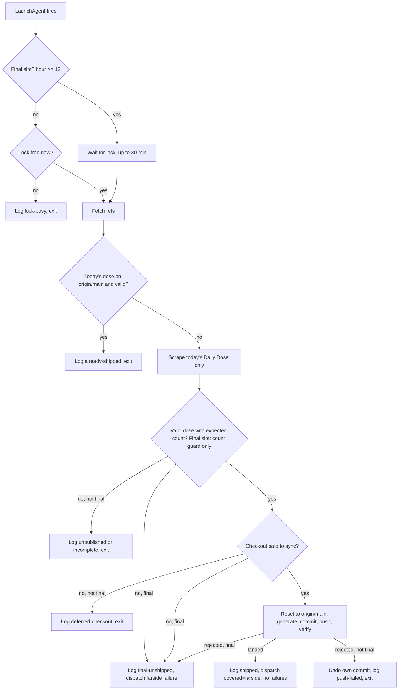

# Far Side Morning Retry Pass - Plan

## Goal Capsule

- **Objective:** Far Side Daily Dose subscribers get each day's strips the same morning the site publishes them, an alert fires only when a day genuinely fails to arrive, and the operator can read when the site actually publishes each day.
- **Means:** A dedicated LaunchAgent retries the Daily Dose every 30 minutes from 03:30 to 12:00 and ships on the first slot that finds it (KD1, KD2, KTD1-KTD9). Pass 1 keeps scraping Far Side but verifies yesterday's dose instead of today's (KD3, KTD10).
- **Authority:**
  - Requirements win on behavior, KTDs win on mechanism, and units override neither.
  - `CLAUDE.md` governs git practice: explicit staging, a green `pytest -v` before any push, conventional commits, code kept apart from feed data. This is a pipeline change, so it ships as a branch and PR.
  - The operator merges the PR and installs the LaunchAgent on the host.
- **Stop and ask when:**
  - Any change would make a slot that finds nothing to do touch the operator's checkout, other than writing into `logs/` or `data/`.
  - The alert reporter's identity or close rules would need to change beyond adding a slug name.
  - A rebase conflict appears on `git pull --rebase`.
- **Execution profile:** U1, U2 and U3 are independent. U4 builds on U1, U2 and U3, and U5 on U1 and U2. U6 follows U4 and U5. U7 happens on the host after merge.
- **Who finishes:** `ce-work` implements U1-U6 and opens the PR. The operator merges and loads the LaunchAgent. U7's three-morning watch and solution doc follow.

---

## Product Contract

### Summary

A new Far Side morning pass runs every half hour from 03:30 to 12:00 on the pipeline host. Each slot checks whether today's Daily Dose is already on `origin/main`, scrapes only today's Daily Dose if not, and ships it on the first slot that finds a complete dose. Only the noon slot alerts. Every slot records its outcome so the publish time can be read off the log. Pass 1 stops expecting today's dose at 03:20 and checks yesterday's instead, plus whether the morning pass finished yesterday.

### Problem Frame

thefarside.com publishes its Daily Dose at `/YYYY/MM/DD`, and an unpublished date redirects to the homepage. Since 2026-10-01 the scraper correctly writes no file for a date the site hasn't published. On 2026-10-01, 10-02 and 10-03 the site had not published by the 03:20 CDT scrape, against two late days in the previous 169. The invariant guard then flags `data/farside_daily_<today>.json` as missing, issue #219 collects a comment every morning, and subscribers get the day's strips a night late unless someone fills the gap by hand.

The publish time is only bounded: after 03:20 CDT on each of the three late days, and before 09:19 on Thursday and 09:31 on Saturday. A fixed later run time would be a guess and would ship late on early days. The Daily Dose has 5 strips Monday to Friday and 2 on Saturday and Sunday, without exception across 170 saved days.

### Requirements

**Delivery**

- R1. When the site publishes a complete Daily Dose before noon, the strips reach `public/feeds/farside-daily.xml` on `origin/main` by the first slot after publication.
- R2. Slots run every 30 minutes from 03:30 to 12:00 host-local time. A slot that finds the day already shipped, or not yet published, changes nothing in git or on GitHub.
- R3. Before the final slot, a dose ships only with its expected count: 5 strips Monday to Friday, 2 on Saturday and Sunday. The final slot ships any dose that passes the existing count guard.

**Alerting**

- R4. Only the final slot raises an alert for a day that has not shipped. Earlier slots never dispatch a failure.
- R5. Daily Dose problems from either pass land on one shared alert issue, and the next run that ships or verifies the Daily Dose closes it. No run closes an issue for something it did not examine.
- R6. Pass 1 alerts when yesterday's Daily Dose file is missing or empty, or when the morning pass recorded no final outcome for yesterday.

**Safety**

- R7. The morning pass never discards uncommitted changes, unpushed commits or a checked-out branch in the operator's checkout. When the checkout is not safe to sync, the slot defers to the next one.
- R8. Pass 1, catch-up, Pass 2 and the morning pass never modify the repository at the same time.

**Measurement**

- R9. Every slot that runs records a timestamped outcome in a host log, so each day's publish window reads as "after the last unpublished slot, by the first slot that shipped".

**Compatibility**

- R10. Running the Far Side scraper with no arguments behaves exactly as it does today.

### Key Decisions

- KD1. **Retry every 30 minutes until shipped.** Governs R1, R2, R4. (session-settled: user-approved — chosen over a single fixed-time run or adding Far Side to the 13:00 Pass 2: the publish time is unknown and has drifted, so a fixed time is a guess)
- KD2. **First slot at 03:30.** Governs R2, R9. (session-settled: user-directed — chosen over a 05:00 start: starting right after Pass 1 narrows the measured publish window between 03:30 and 09:00)
- KD3. **Pass 1 keeps scraping Far Side and checks yesterday's dose.** Governs R6. (session-settled: user-approved — chosen over moving Pass 1 later for all seven sources: only Far Side moved)
- KD4. **The morning pass covers the Daily Dose only.** Governs R2, R10. (session-settled: user-approved — chosen over also running New Stuff each slot: its Selenium walk is the slow part and New Stuff publishes a few times a year)
- KD5. **One shared Daily Dose alert issue.** Governs R5. (session-settled: user-approved — chosen over a separate issue per pass: whichever pass next sees a good dose should close it)
  - Conflict: the reporter keys issues by slug alone, so a shared `farside` slug would let a morning success close a Pass 1 issue raised for New Stuff, which the morning pass never examines. KTD6 resolves this by moving New Stuff to its own slug, so `farside` means the Daily Dose everywhere.
- KD6. **A per-slot host log that can be read directly.** Governs R9. (session-settled: user-approved — chosen over grepping the run log for the winning slot)

### Acceptance Examples

- AE1. Covers R1, R3, R9.
  - **Given** a Wednesday, and the site publishes all 5 strips at 05:10.
  - **When** the 05:00 slot runs and the 05:30 slot runs.
  - **Then** 05:00 logs "unpublished", 05:30 ships and logs "shipped", and later slots exit without touching git.
- AE2. Covers R3.
  - **Given** a Tuesday, and the 06:00 slot scrapes 3 strips.
  - **When** the slot evaluates the dose.
  - **Then** it logs "incomplete" and ships nothing. A later slot that sees 5 strips ships them.
- AE3. Covers R4, R5, R6.
  - **Given** the site never publishes Friday's dose.
  - **When** the 12:00 slot runs, and then Saturday's Pass 1 runs.
  - **Then** the noon slot opens or comments on the Far Side issue. Saturday's Pass 1 finds Friday's file still missing and comments again. The first later run that ships or verifies a dose closes it.
- AE4. Covers R2, R9.
  - **Given** Pass 1 caught an early publish at 03:20 and pushed today's dose.
  - **When** the 03:30 slot runs.
  - **Then** it logs "already-shipped" and dispatches nothing, as does every later slot that day.
- AE5. Covers R7.
  - **Given** the operator has uncommitted edits in the main checkout at 08:00, and the dose has just been published.
  - **When** the 08:00 slot finds a complete dose.
  - **Then** it logs "deferred-checkout" and leaves the checkout untouched. The first slot after the checkout is clean ships the dose. If none is clean by noon, the final slot alerts.

### Success Criteria

- Over the first week after install, each day's dose is on `origin/main` by the first slot after the site published it, with no hand-filled gaps.
- Issue #219 closes after deploy, expected at the first Pass 1 under the new guard, and no Far Side issue opens on a day the dose shipped by noon.
- After a week, the slot log bounds each day's publish time to a 30-minute window, enough to judge whether a fixed run time would serve.

### Scope Boundaries

- The Far Side New Stuff feed stays in Pass 1, unchanged except for its alert slug.
- Pass 1 and Pass 2 schedules do not change.
- Count minimums in `scripts/check_scrape_counts.py` do not change. The weekday/weekend expectation applies only to the morning pass's ship decision.
- Considered and not built:
  - **A dedicated git worktree for the morning pass.** It would isolate the pass from the operator's checkout entirely, but needs worktree lifecycle handling and a package path that does not resolve to the main checkout's editable install. KTD4's safe-sync rule closes the same harm with less. Revisit if the slot log shows frequent "deferred-checkout" outcomes.
  - **Telling "site unpublished" apart from "fetch failed" in the noon alert.** The scraper returns nothing for both. The issue points at the host log, which shows the redirect or the network error. Revisit if noon alerts start firing for network reasons.
  - **A separate push-recovery mode.** A rejected push undoes the slot's own commit and the next slot retries from scratch (KTD8). Revisit if pushes are rejected often enough to delay shipping.

#### Deferred to Follow-Up Work

- Moving Pass 1 and Pass 2 onto the same safe-sync rule. They run at 03:05 and 13:00, so the overlap with working hours is smaller.
- Choosing a single fixed Far Side run time once a week or more of slot logs exists.

---

## Planning Contract

### Key Technical Decisions

- KTD1. **A thin shell orchestrator calls a pure, unit-tested Python helper for every decision.** CI runs pytest on Ubuntu, where shell scripts and BSD `date` cannot be tested, and the repo already splits checks this way (`scripts/check_host_config.py`: pure `evaluate`, impure `gather`, `main`). The helper owns the slot date, whether a slot is final, the expected count, the ship decision, the safe-sync verdict from git-state readings, and reading and writing the slot log. Git, the scraper, the generator and the alert dispatch stay in shell.
- KTD2. **"Already done" means today's file is on `origin/main` and passes the count check, never that a local file exists.** Each slot fetches refs only and checks the copy at `origin/main`. A local file can exist after a failed push, and nothing else validates today's file once Pass 1's guard moves to yesterday. Instances R2, KD1.
- KTD3. **The scraper gains an additive CLI.** A daily-only mode never touches New Stuff. Given a date it scrapes only that date and no other file; without one it scrapes the usual three-day window, which is what Pass 1 needs. A New Stuff-only mode serves Pass 1's other invocation. No arguments keeps today's three-day window plus New Stuff (R10). The scraper already writes no file when the dated URL redirects.
- KTD4. **Safe-sync rule for the success path.** A slot syncs and commits only when the operator's checkout is on `main`, its `HEAD` is an ancestor of `origin/main`, and it has no staged or unstaged changes to tracked files other than the slot's own `data/farside_daily_<date>.json`. That file is the one path the slot itself wrote, and it is tracked when an invalid copy is already on `origin/main`. The slot copies it aside, resets to `origin/main`, and restores it, the save-reset-restore pattern Pass 1's push recovery already uses. Under those conditions the reset discards nothing of the operator's. The check runs after the SSH preflight and immediately before the reset, so the window in which an operator edit could be lost is as short as possible. The commit names its two paths explicitly, so nothing else the operator staged can ride along. Otherwise the slot logs "deferred-checkout" and exits. No branch switching, ever. No-op paths run no reset, no SSH preflight and no branch guard. Instances R7.
- KTD5. **A shared kernel lock via macOS `/usr/bin/lockf` on `logs/pipeline.lock`, taken by each tracked orchestrator.** Pass 1's, Pass 2's and the morning pass's tracked scripts each re-run themselves under `lockf` when a lock-held marker is unset, and set the marker for the child. Host wrappers, catch-up and the direct manual runs the repo's recovery docs prescribe therefore all take the same lock. The kernel releases it when the process exits, so there is no stale-lock cleanup, and `lockf` does not pass it to child processes such as a lingering Chrome. Pass 1 and Pass 2 wait up to 30 minutes. A non-final morning slot uses a zero timeout and logs "lock-busy" when it cannot get the lock. The final slot waits like Pass 1, so a long catch-up run cannot swallow the noon alert. Instances R8.
- KTD6. **`farside` means the Daily Dose in every pass, and New Stuff moves to its own `farside-new` slug.** Pass 1 runs the Daily Dose window and New Stuff as two scraper invocations, so a New Stuff crash maps to `farside-new`. The morning pass dispatches `run=farside-morning`, `covered=farside`, and reports its own infrastructure failures as `farside:<kind>`, so it never closes Pass 1's `push`, `preflight` or `branch` issues. The reporter needs only a display name for the new slug. Instances KD5, R5.
- KTD7. **Dispatch only from a slot that shipped, or from the final slot when the day has not shipped.** A shipping slot dispatches with no failures, which closes an open Far Side issue. The final slot dispatches one failure whose kind names the last cause it saw: unpublished, incomplete, checkout or push. Earlier failures stay in the log and the next slot retries. Instances R4.
- KTD8. **One commit per day, subject `Far Side Daily Dose for <date>`.** The subject must not start with any heartbeat prefix in `scripts/check_pipeline_heartbeat.py`, or a morning commit could mask a dead Pass 1. The body names the slot that found the dose and the last slot that missed it. Staging is explicit: today's daily JSON and `public/feeds/farside-daily.xml` only. The generator also rewrites `public/feeds/farside-new.xml` on every run, so the slot restores that file after committing and a ship leaves no tracked change behind. Push uses Pass 2's watchdog and verifies it landed. A rejected or unverified push resets back to `origin/main`, which drops only the slot's own commit under KTD4, and the next slot retries.
- KTD9. **The slot log is `logs/farside_morning_slots.log`, one line per slot.** Each line holds an ISO-8601 timestamp with UTC offset, the Daily Dose date, the outcome and the strip count. Terminal outcomes are "already-shipped", "shipped" and "final-unshipped". `logs/` is gitignored and survives resets. The offset keeps lines comparable across the 2026-11-01 DST change.
- KTD10. **Pass 1's Far Side guard checks yesterday's daily file and the slot log.** Yesterday is computed before the guard, not only inside push recovery as today. A missing terminal outcome for yesterday raises `farside:morning-pass`. The check is skipped when the slot log has no entry dated before yesterday, which covers the first night after install and any manual runs made on install day. The New Stuff file check stays on today, under `farside-new`. Instances KD3, R6.
- KTD11. **The slot date is the host-local date, passed explicitly to the scraper.** Within 03:30-12:00 Central it always equals the site's Eastern date. A coalesced firing after a late wake still targets the local day instead of rolling into tomorrow's Eastern date.

### High-Level Technical Design

One morning slot, from the LaunchAgent firing to exit:

How the passes share a day after this change:

| Time (CDT) | Run | Far Side work | Alert role for `farside` |
|---|---|---|---|
| 03:05 | Pass 1 | Scrapes the 3-day Daily Dose window and New Stuff, checks yesterday's file and yesterday's terminal slot outcome | Opens, comments or closes on yesterday's dose |
| 03:30-11:30 | Morning slots | Ship today's dose once it is complete | Close on ship, never open |
| 12:00 | Final slot | Ship anything that passes the count guard | Open or comment if the day has not shipped |
| 13:00 | Pass 2 | None | Does not cover `farside` |
| At login | Catch-up | Same as Pass 1 when today's GoComics file is missing | Same as Pass 1 |

### Implementation Constraints

- The tracked morning orchestrator follows `scripts/local_pass2_update.sh`, not the wrappers. It does not use `set -e`, because an unpublished date and several git probes exit nonzero in normal operation. It branches on each step's exit status, keeps a `tee`'d log under `logs/`, dispatches with `|| true`, and always exits 0 so launchd never retries.
- Only the thin `mini_*` host wrappers use `set -eu`.
- Python follows the `main(argv=None)` plus argparse shape of `scripts/check_scrape_counts.py`.
- The LaunchAgent plist is not tracked, like the existing three. Its full content goes in `docs/LOCAL_AUTOMATION_README.md`.

### Sources and Research

- Pass 2 template: `scripts/mini_master_pass2.sh` and `scripts/local_pass2_update.sh`, especially the watchdog push and landed-check, and explicit staging.
- Alert identity and close rules: `scripts/report_pipeline_failures.py` (`report()`, `parse_failed`, `SOURCE_NAMES`), with the covered-set scoping tests in `tests/test_report_pipeline_failures.py` as the template for KTD6.
- Pass 1 guard: `check_scrape_output` in `scripts/local_master_update.sh`. Yesterday is computed today only inside push recovery.
- Heartbeat prefixes: `scripts/check_pipeline_heartbeat.py`.
- Learnings: `docs/solutions/logic-errors/farside-unpublished-date-recorded-yesterdays-dose.md` (never write a placeholder dose), `docs/solutions/logic-errors/silent-empty-scrape-passed-as-success.md` and `docs/solutions/best-practices/verify-postconditions-not-success-signals.md` (KTD2), `docs/solutions/logic-errors/gocomics-favorites-page-timing.md` (Pass 2's staging bug, KTD8).
- Pass 1 has finished as late as 03:35, and catch-up runs have ended at 09:34, 10:43 and 12:16, all inside the morning window (KTD5).

---

## Implementation Units

### U1. Scraper CLI modes

- **Goal:** Let callers scrape exactly one day's Daily Dose, or New Stuff alone, without changing the no-argument behavior.
- **Requirements:** R2, R10, KTD3, KTD11.
- **Dependencies:** None.
- **Files:** `scripts/scrape_farside.py`, `tests/test_scrape_farside.py` (new).
- **Approach:**
  1. Add argparse to `main(argv=None)` with a daily-only mode, an optional single date, and a New Stuff-only mode. The two modes are mutually exclusive, and a date requires daily-only.
  2. Daily-only with a date scrapes and saves only that date, through the existing save path, and exits 0 when a file was written and 1 when not. Daily-only without a date runs the three-day window and keeps its current exit rule.
  3. No arguments keeps the three-day window plus New Stuff and today's exit codes.
- **Patterns to follow:** `scripts/check_scrape_counts.py` for the argparse shape. `tests/test_farside_scraper.py` for faking responses, including the 302 redirect.
- **Test scenarios:**
  - Daily-only with a published date writes `data/farside_daily_<date>.json` with the scraped strips and exits 0.
  - Daily-only with an unpublished date writes no file, leaves other dates' files untouched, and exits 1.
  - Daily-only never calls the New Stuff scrape and never changes the New Stuff cursor file.
  - Daily-only without a date scrapes the three-day window and nothing else.
  - New Stuff-only runs the New Stuff scrape and writes no daily files.
  - No arguments runs the three-day window and New Stuff, as today.
  - Passing both modes is rejected with a usage error.
- **Verification:** The new tests pass. A no-argument run on the host logs the same sequence as last night's Pass 1.

### U2. Morning-pass decision helper

- **Goal:** Put every slot decision in one pure, testable Python module.
- **Requirements:** R3, R4, R6, R9, KTD1, KTD2, KTD9, KTD10, KTD11.
- **Dependencies:** None.
- **Files:** `scripts/farside_morning.py` (new), `tests/test_farside_morning.py` (new).
- **Approach:**
  1. Pure functions take the clock, dates, git-state readings and file contents as inputs: slot date, final-slot test, expected count by weekday, ship decision, safe-sync verdict, slot-log line format, and whether a date has a terminal outcome.
  2. A thin `main` exposes subcommands the shell calls. One evaluates a dose file and prints the decision. One reports the safe-sync verdict from git-state readings the shell gathers. One appends a slot-log line. One answers "does yesterday have a terminal outcome" for Pass 1, with KTD10's skip rule.
  3. The ship decision reuses `scripts/check_scrape_counts.py` for validity, then applies the expected count before the final slot.
- **Patterns to follow:** `scripts/check_host_config.py` and its tests (`evaluate` / `gather` / `main`, monkeypatched `TestMain`).
- **Test scenarios:**
  - A Monday dose with 5 strips at 06:00 ships. With 3 strips it is "incomplete".
  - A Saturday dose with 2 strips at 06:00 ships.
  - At 12:00 a weekday dose with 3 strips ships, and an empty or missing file is "final-unshipped".
  - The final-slot test is true at 12:00 and at a coalesced 23:30 firing, false at 11:30.
  - The slot date at 23:30 local is the local date, not the next Eastern date.
  - A log line carries an ISO timestamp with UTC offset, the date, the outcome and the count, and lines written either side of the 2026-11-01 DST change both parse.
  - The terminal-outcome check is true for "shipped", "already-shipped" and "final-unshipped" lines, and false when the date only has "unpublished" or "lock-busy" lines.
  - The terminal-outcome check reports "skip" when the log file does not exist, and when its only entries are dated yesterday or later.
  - The safe-sync verdict is safe on `main` with a clean tree and `HEAD` an ancestor of `origin/main`.
  - The safe-sync verdict is safe when the only changed tracked path is the slot's own daily file.
  - The safe-sync verdict is unsafe on another branch, with any other changed or staged tracked file, and when `HEAD` has a commit not on `origin/main`.
- **Verification:** The new tests pass, and no function reads the real clock or filesystem except through `main`.

### U3. Shared pipeline lock

- **Goal:** Keep any two pipeline runs from modifying the repository at once.
- **Requirements:** R8, KTD5.
- **Dependencies:** None.
- **Files:** `scripts/local_master_update.sh`, `scripts/local_pass2_update.sh`.
- **Approach:**
  1. At the top of each script, re-run it under `lockf` with a 30-minute wait unless the lock-held marker is set, per KTD5.
  2. If the wait times out, log a clear line and exit 0. The heartbeat already covers a Pass 1 that never ran.
  3. The host wrappers stay unchanged, so catch-up and direct manual runs take the lock the same way.
- **Execution note:** Shell wrappers have no test harness in this repo. Prove the lock on the host with a held lock and a manual run, as the Verification Contract describes.
- **Test expectation:** none -- a lock call at the top of two shell scripts, which this repo cannot unit-test; the lock is proven on the host per the Verification Contract.
- **Verification:** With the lock held by a sleeping process, a direct run of Pass 2's tracked script waits until the lock is released.

### U4. Morning orchestrator

- **Goal:** Run one slot end to end, as the High-Level Technical Design flowchart shows.
- **Requirements:** R1, R2, R4, R5, R7, R9, KTD2, KTD4, KTD6, KTD7, KTD8.
- **Dependencies:** U1, U2, U3.
- **Files:** `scripts/local_farside_morning.sh` (new), `scripts/mini_farside_morning.sh` (new), `tests/test_check_pipeline_heartbeat.py`.
- **Approach:**
  1. The new host wrapper mirrors `scripts/mini_master_pass2.sh`. The orchestrator takes the lock per KTD5, with the wait chosen from U2's final-slot answer. A non-final slot that cannot get the lock appends "lock-busy" and exits 0. Log to `logs/farside_morning.log` with the same rotation as Pass 2.
  2. No-op path: fetch refs, check today's dose on `origin/main` through U2, else scrape today in daily-only mode and evaluate through U2. Log and exit on anything but a ship decision. No reset, preflight or branch guard here.
  3. Success path, in KTD4's order: run the SSH preflight, apply the safe-sync check, save the slot's own daily file, reset to `origin/main`, and restore it. Then run the Far Side generator, stage the two explicit paths, commit with those two paths named, restore `public/feeds/farside-new.xml`, push with the watchdog and verify.
  4. Dispatch exactly as KTD7 states. Append the slot outcome on every path.
- **Execution note:** Prove the no-op paths on the host before the success path is ever live. A manual run on a day already shipped must leave `git status` and the reflog unchanged.
- **Patterns to follow:** `scripts/local_pass2_update.sh` for logging, `.env` and venv activation, the SSH preflight, `push_with_watchdog` and `verify_push_landed`.
- **Test scenarios:**
  - A commit subject `Far Side Daily Dose for 2026-10-04` does not count as a pipeline heartbeat in `scripts/check_pipeline_heartbeat.py`.
- **Verification:** On the host: a no-op run changes nothing in git, the git-state probe reports unsafe with an edited tracked file, and the first real morning ships one commit touching exactly the two staged paths and leaves `git status` with no tracked changes.

### U5. Pass 1 alert and guard changes

- **Goal:** Make `farside` mean the Daily Dose in Pass 1, and have Pass 1 check yesterday's dose and yesterday's morning outcome.
- **Requirements:** R5, R6, KTD6, KTD10.
- **Dependencies:** U1, U2.
- **Files:** `scripts/local_master_update.sh`, `scripts/report_pipeline_failures.py`, `tests/test_report_pipeline_failures.py`, `.github/workflows/pipeline-alert.yml`.
- **Approach:**
  1. Split the Far Side scrape step into two U1 invocations, daily-only without a date and New Stuff-only, with distinct failure labels under `farside` and `farside-new`.
  2. Compute yesterday before the guard. Point the Daily Dose file check at yesterday. Keep the New Stuff file check on today under `farside-new`. Add the U2 terminal-outcome check under `farside:morning-pass`.
  3. Add `farside-new` to `ALERT_COVERED` and a "Far Side New Stuff" display name to `SOURCE_NAMES`. Add `farside-morning` to the workflow input's description.
  4. Stage `data/farside_new_last_id.txt` with Pass 1's data files. Pass 1 stages only `data/*.json` today, so a New Stuff cursor advance leaves that tracked file modified, and KTD4 would defer every morning slot that day.
- **Patterns to follow:** The existing `check_scrape_output` calls. The "Pass 2 scoping" tests in `tests/test_report_pipeline_failures.py`.
- **Test scenarios:**
  - A run with `covered=farside` and no failures closes an open `farside` issue and leaves an open `farside-new` issue alone.
  - A run with `covered=farside` and no failures leaves open `push` and `preflight` issues alone.
  - `farside-new` displays as "Far Side New Stuff" in a new issue's title.
  - A `farside:morning-pass` failure opens a Far Side issue whose title names the kind.
- **Verification:** The reporter tests pass. On the host, a dry read of the guard section with yesterday's date resolves to the expected files.

### U6. Documentation

- **Goal:** Make every place that describes the schedule, the passes or the Far Side guard match the new behavior.
- **Requirements:** All, as documentation of R1-R10.
- **Dependencies:** U4, U5.
- **Files:** `docs/LOCAL_AUTOMATION_README.md`, `AGENTS.md`, `CONCEPTS.md`, `README.md`, `docs/solutions/logic-errors/farside-unpublished-date-recorded-yesterdays-dose.md`, `scripts/check_pipeline_heartbeat.py` (docstring and alert text), `scripts/report_pipeline_failures.py` (docstring).
- **Approach:**
  1. `docs/LOCAL_AUTOMATION_README.md`: a morning-pass subsection with its covered set, the full plist with its 18 `StartCalendarInterval` entries and the `launchctl load -w` step, the lock, the slot log and how to read a publish window, and triage for a Far Side issue.
  2. `AGENTS.md` and `CONCEPTS.md`: replace "twice daily" with the three runs, extend "Two-pass scrape" or add a "Morning pass" entry, and update "Covered set" and "Invariant guard". `CLAUDE.md` imports `AGENTS.md`, so it needs no edit.
  3. The Far Side solution doc's "Known side effect" section points to this pass.
- **Test expectation:** none -- documentation only.
- **Verification:** A grep for "twice daily", "twice a day" and "both passes" finds no stale statement.

### U7. Install, watch and write up

- **Goal:** Turn the pass on, confirm it behaves for three mornings, and record what it measured.
- **Requirements:** Success Criteria.
- **Dependencies:** PR merged.
- **Files:** `docs/solutions/` (new solution doc via `ce-compound`).
- **Approach:**
  1. Merge after the day's Pass 2, so the next Pass 1 is the first to run the new guard. Then load the LaunchAgent.
  2. For three mornings, read the slot log, the morning commit and the issue state. Confirm #219 closes, which is expected at the first Pass 1 after merge because it verifies yesterday's re-scraped file, and that the first morning ship dispatches with no failures.
  3. Write the solution doc with the measured publish windows, and update the operator's memory note on Far Side late publishes.
- **Test expectation:** none -- operational rollout.
- **Verification:** Three mornings shipped by the first slot after publication, no stray Far Side issues, and the solution doc on `main`.

---

## Verification Contract

| Gate | How | Applies to |
|---|---|---|
| Unit tests | `pytest -v` green locally and in the PR's CI on Python 3.10, 3.11 and 3.12 | U1, U2, U4, U5 |
| No-op safety | On the host, with today's dose already on `origin/main`, a manual morning-wrapper run logs "already-shipped" and leaves `git status`, `HEAD` and the reflog unchanged | U4 |
| Dirty checkout | U2's safe-sync verdict tests pass, and on the host the orchestrator's git-state probe reports unsafe with an uncommitted edit to a tracked file, which survives | U2, U4 |
| Lock | Before 12:00 local, and after a slot has logged a terminal outcome for today: with `logs/pipeline.lock` held by a sleeping `lockf` process, a manual morning run logs "lock-busy", and a direct run of Pass 2's tracked script waits | U3, U4 |
| Feed preview | After the first morning ship, `scripts/preview_feeds.py public/feeds/farside-daily.xml --against` the previous commit shows only the day's strips as new | U4, U7 |
| Production watch | Three mornings of slot log, commits and issue state | U7 |

Any manual morning run at or after 12:00 local is the final slot and can dispatch a real Far Side alert.

---

## Definition of Done

- U1-U6 are merged to `main` through a PR with green CI, and the LaunchAgent is loaded on the host.
- Every gate in the Verification Contract has passed.
- Issue #219 is closed, and the first morning ship dispatched `covered=farside` with no failures.
- The solution doc records at least three measured publish windows.
- No abandoned-attempt code, debug output or temporary flags remain in the diff.
